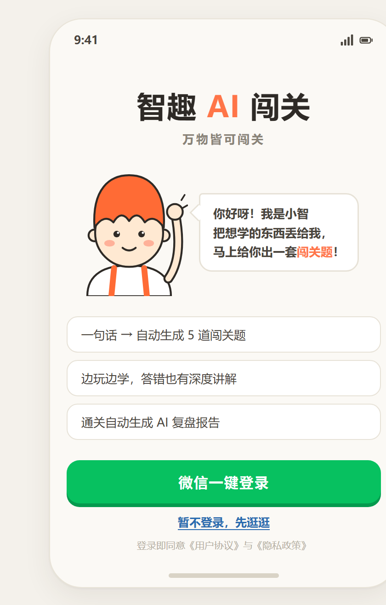
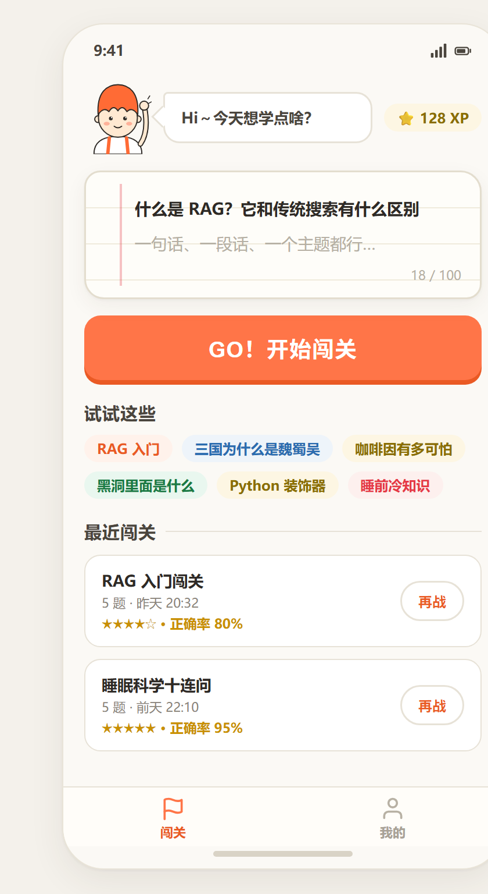
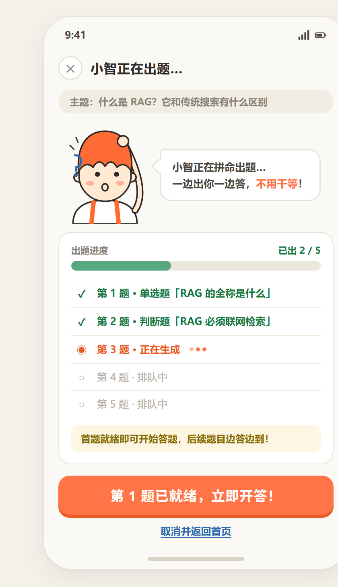
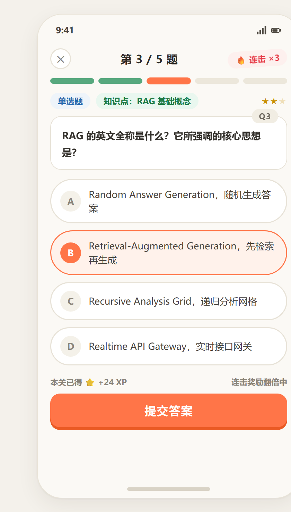
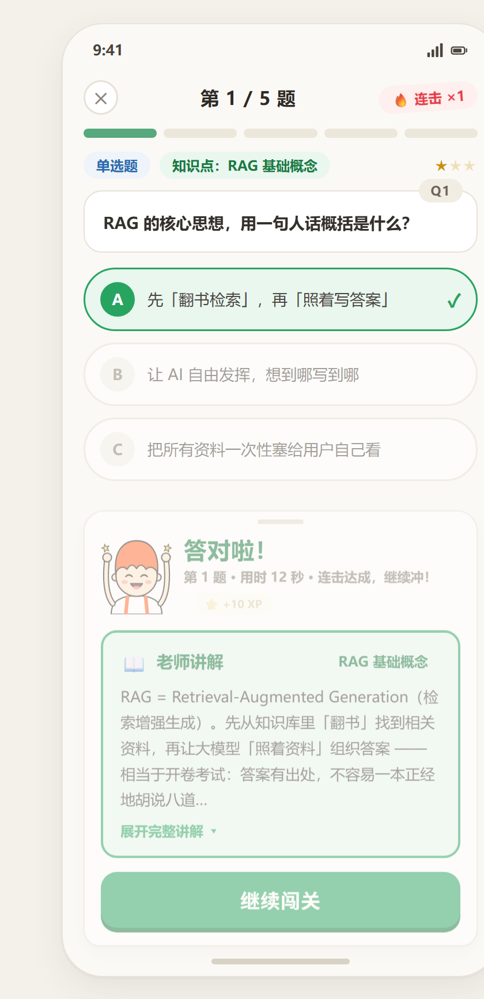
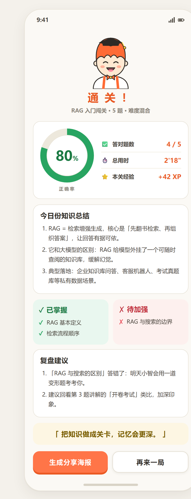
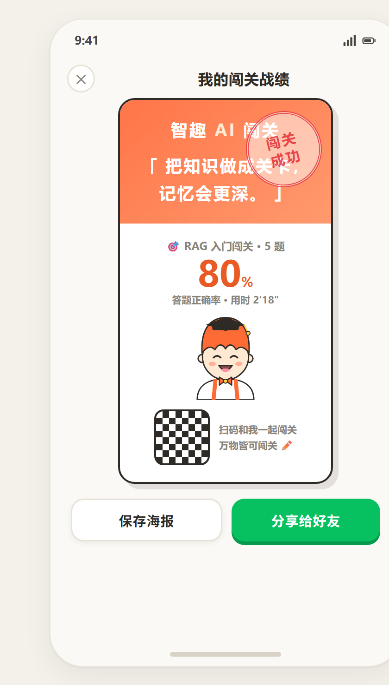
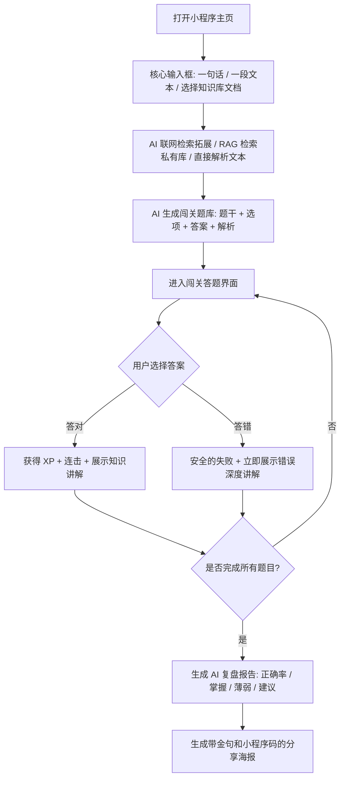
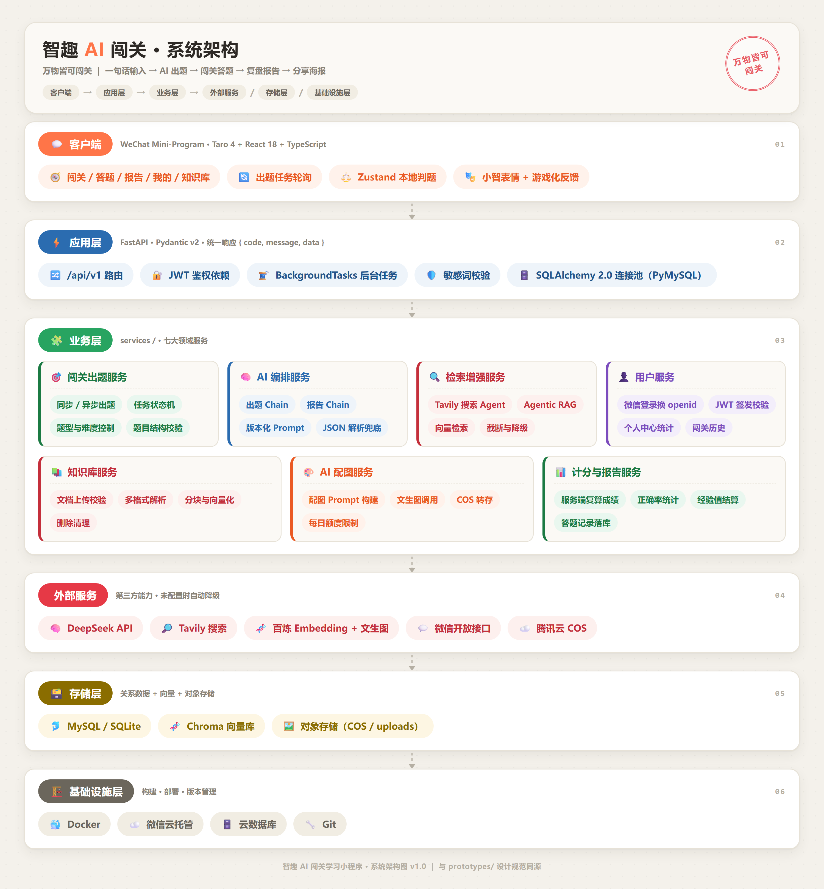

<div align="center">


# 智趣 AI 闯关学习小程序

**「万物皆可闯关」** —— 输入一句话，AI 自动出题；逐题闯关 + 即时讲解；通关生成 AI 复盘报告与分享海报。

把任何想学的知识，变成一局好玩的游戏。

<br />


</div>

---

## ✨ 项目简介

「智趣 AI 闯关」是一款深度集成微信生态的 **AI 游戏化学习小程序**。它解决现代学习者的两大痛点：**信息过载** 与 **学习动力不足**。

你只需要丢给它一句话、一个主题，甚至一份私有文档，AI 就会：

1. **联网检索 / 解析知识库**，补全并校准知识；
2. **自动生成** 单选、多选、判断题，每题配备 AI 深度讲解；
3. 让你 **逐题闯关**，答对答错都有即时反馈与知识讲解；
4. 通关后产出 **AI 复盘报告**（正确率、掌握点、薄弱点、总结、建议）；
5. 一键生成 **分享海报**，把学习成果晒给好友。

> 完整方案见 [`docs/`](docs/)，UI 高保真原型见 [`prototypes/`](prototypes/)。前端 UI 严格 1:1 还原原型 v1.2。

### 核心闭环

```
输入主题 / 选择知识库文档
        ↓
AI 出题（异步任务 + 轮询，首题就绪即可开答）
        ↓
闯关答题（单选 / 多选 / 判断 · 本地即时判题）
        ↓
即时反馈（答对奖励 / 答错讲解 · XP + 连击）
        ↓
AI 复盘报告（正确率环 · 掌握 / 薄弱 · 总结建议）
        ↓
Canvas 分享海报（学习金句 + 小程序码）
```

---

## 📱 界面预览

> 以下为高保真原型渲染图（与线上小程序 1:1 同源设计）。

| 微信登录 | 首页 · 极简输入 | AI 出题进度 | 闯关答题 |
| :---: | :---: | :---: | :---: |
|  |  |  |  |
| **即时反馈** | **通关报告** | **分享海报** | |
|  |  |  | |

---

## 🎯 核心特性

### 出题引擎
- **多源知识 grounding**：联网检索（Tavily）→ 私有知识库 RAG（Chroma + 百炼 Embedding）→ 纯模型兜底，三级降级。
- **异步出题 + 轮询**：提交任务立即返回 `task_id`，前端轮询进度；**首题就绪即可开答**，边答边出，无需干等。
- **题型齐全**：单选 / 多选 / 判断，含难度、知识点标签与 AI 深度讲解。
- **题目 AI 配图**（可选）：百炼文生图 + 腾讯云 COS，按人按日限流，未配置时静默降级。

### 答题与游戏化
- **本地即时判题**：选择后立即给出对错与讲解，不等待后端。
- **XP / 连击 / 星级**：答对累积经验与连击，答错「安全的失败」不扣分红字。
- **分段进度指示器**：答对绿 · 答错红 · 当前橙 · 未答灰，一目了然。
- **反馈抽屉 + 小智表情**：5 套吉祥物表情随答题情绪切换，陪伴感拉满。

### 复盘与分享
- **AI 复盘报告**：正确率环、答对题数、总用时、本关经验、知识总结、已掌握 / 待加强、复盘建议、分享金句。
- **Canvas 分享海报**：学习金句 + 正确率 + 小程序码，支持保存相册与转发好友。

### 用户与数据
- **微信一键登录**（JWT），昵称 / 头像编辑与头像上传。
- **闯关记录持久化**：服务端权威复算成绩，历史列表、单局详情、累计统计（闯关次数 / 平均正确率 / 累计 XP）。
- **错题 / 复盘回顾页**：回看历史对局与讲解。

### 私有知识库（RAG）
- 上传 **pdf / docx / md / txt**（≤10MB），后台自动解析、分块、向量化。
- 出题时勾选知识库文档，AI 基于你的私有资料出题（企业考核 / 真题模拟场景）。

---

## 🔄 核心业务流程



---

## 🧰 技术栈

| 层 | 选型 |
| --- | --- |
| **前端框架** | Taro 4.2.1 + React 18 + TypeScript（微信小程序） |
| **状态管理** | Zustand（会话状态 + 本地判题） |
| **后端框架** | FastAPI + Pydantic v2 |
| **LLM 编排** | LangChain（出题链 / 报告链 / 研究链 + 结构化输出 Schema） |
| **大模型** | DeepSeek（OpenAI 兼容接口，`deepseek-flash`） |
| **联网检索** | Tavily（研究阶段 grounding） |
| **向量检索** | Chroma（持久化）+ 百炼 `text-embedding-v4` |
| **文生图** | 百炼 `qwen-image-2.0` + 腾讯云 COS 存储 |
| **数据库** | MySQL 8（生产）/ SQLite（本地兜底） |
| **认证** | 微信 `code2session` + JWT |
| **测试** | pytest（全程 mock LLM，不消耗额度） |

---

## 🏗️ 系统架构



> 分层架构：客户端 → 应用层 → 业务层 → 外部服务 / 存储层 / 基础设施层。
> 图为 [`assets/architecture.html`](assets/architecture.html) 渲染产物，可直接修改该 HTML 后重新截图更新。

---

## 🗂 目录结构

```
ai-quizChallenge/
├─ backend/                  FastAPI 后端（TDD，pytest 全量 mock LLM）
│  ├─ app/
│  │  ├─ api/v1/routes/      接口层（health/auth/quiz/report/user/kb/meta + 统一响应）
│  │  ├─ core/               配置 / 异常 / 日志 / 安全（JWT）
│  │  ├─ db/                 ORM 模型 + 会话（MySQL / SQLite）
│  │  ├─ llm/                LangChain 工厂 + 出题链 + 报告链 + 研究工具 + 输出 Schema
│  │  ├─ models/             领域模型（Quiz/Question/Report/User/Kb…）
│  │  ├─ prompts/            版本化 Prompt
│  │  ├─ services/           出题/评分/报告/记录/用户/知识库/配图/研究 服务 + 任务存储
│  │  └─ utils/              清洗 / 敏感词 / ID / 内容过滤
│  ├─ tests/                 pytest 用例
│  ├─ kb_data/               Chroma 向量持久化目录
│  └─ uploads/               头像 / 知识库原始文件（经 /static 挂载）
├─ frontend/                 Taro 小程序（9 屏）
│  └─ src/
│     ├─ pages/              index / login / generating / quiz / report / review / poster / profile / kb
│     ├─ components/         Mascot（小智 5 表情）等
│     ├─ store/              Zustand 会话状态 + 本地判题
│     ├─ services/           请求封装 / API / 轮询 / 本地存储 / Token
│     └─ types/              前后端契约类型
├─ assets/                   Logo 与界面截图
├─ docs/                     需求 + 方案设计文档
└─ prototypes/               UI 高保真原型（设计规范 + 核心流程）
```

---

## 🚀 快速开始

### 一、后端

#### 1. 安装依赖

```bash
cd backend
python -m venv .venv
# Windows
.venv/Scripts/python.exe -m pip install -r requirements.txt
# macOS / Linux
# source .venv/bin/activate && pip install -r requirements.txt
```

#### 2. 配置环境变量

复制 `.env.example` 为 `.env`，至少填入 DeepSeek Key：

```
DEEPSEEK_API_KEY=sk-你的真实key
```

> 在 https://platform.deepseek.com 申请。其余 Key（Tavily / 百炼 / COS / 微信）均为可选，留空时对应功能自动降级。

#### 3. 准备数据库（可选）

- 默认读取 `.env` 的 `DB_*` 连接 MySQL（需先建库）：
  ```sql
  CREATE DATABASE ai_quiz CHARACTER SET utf8mb4;
  ```
  启动后自动建表。
- `DB_*` 全部留空时回退本地 SQLite，便于快速跑通。

#### 4. 运行测试（TDD）

```bash
.venv/Scripts/python.exe -m pytest
```

#### 5. 启动服务

推荐使用标准启动脚本（会先清空可能失效的 `DASHSCOPE_API_KEY` 环境变量，避免覆盖 `.env`）：

```bash
start_backend.bat
```

或手动启动：

```bash
.venv/Scripts/python.exe -m uvicorn app.main:app --reload --host 127.0.0.1 --port 8000
```

- 健康检查：http://127.0.0.1:8000/api/v1/health
- 交互式文档：http://127.0.0.1:8000/docs

### 二、前端（微信开发者工具）

#### 1. 安装依赖 & 编译

```bash
cd frontend
npm install
npm run dev:weapp      # 开发（watch），产物在 frontend/dist
# 或 npm run build:weapp   # 生产构建
```

#### 2. 用微信开发者工具打开

1. 打开「微信开发者工具」→ 导入项目，目录选择 `frontend/`（读取 `frontend/project.config.json`，产物在 `frontend/dist`）。
2. AppID 选择「测试号」即可。
3. 在「详情 → 本地设置」勾选 **不校验合法域名**（本地直连 `http://127.0.0.1:8000`）。
4. 后端地址在 `frontend/src/services/config.ts` 的 `API_BASE`，默认 `http://127.0.0.1:8000/api/v1`。

---

## 📄 页面清单

| 页面 | 路径 | 说明 |
| --- | --- | --- |
| 首页 | `pages/index/index` | 极简输入 + 灵感标签 + 最近闯关 |
| 登录 | `pages/login/index` | 微信一键登录引导 |
| 出题进度 | `pages/generating/index` | 异步出题轮询 + 逐题进度 |
| 闯关答题 | `pages/quiz/index` | 单选 / 多选 / 判断 + 即时反馈 |
| 通关报告 | `pages/report/index` | AI 复盘报告 |
| 复盘回顾 | `pages/review/index` | 历史对局与讲解回看 |
| 分享海报 | `pages/poster/index` | Canvas 海报生成与分享 |
| 我的 | `pages/profile/index` | 个人资料 / 统计 / 设置 |
| 知识库 | `pages/kb/index` | 私有文档上传与管理 |

底部 TabBar：**闯关**（首页）· **我的**（个人中心）。

---

## 🧪 测试

后端采用 TDD，pytest 全程 **mock LLM**，不消耗真实额度：

```bash
cd backend
.venv/Scripts/python.exe -m pytest
```

覆盖出题链、评分、报告、记录、用户、知识库、配图、研究、安全与工具函数等模块。

---

## 🗺 范围与路线图

### 已完成（MVP + 扩展）
- ✅ 核心闭环全接真实后端：输入 → 异步出题 → 答题即时反馈 → AI 复盘报告 → 分享海报。
- ✅ 用户系统：微信登录、资料编辑、头像上传、闯关记录持久化与统计。
- ✅ 私有知识库 RAG：文档上传 / 解析 / 向量化 / 勾选出题。
- ✅ 联网检索 grounding 与题目 AI 配图（可选开关）。
- ✅ 前端本地判题、XP / 连击 / 分段进度 / 反馈抽屉 / 小智表情。

### 占位 / 待完善
- ⏳ 分享海报的小程序码为占位图（真实 wxacode 需 appid + 已备案后端）。
- ⏳ 艾宾浩斯「旧识重温」宝藏关卡（复盘建议已埋点）。

### 后续规划（按优先级）
- **P1**：多格式源解析（PDF/Word/网页/视频）、后台错题与图表分析。
- **P2**：知识库文档一键开始闯关、社交对战与排行榜、多模态生图交互。
- **P3**：多元化付费模型（VIP / 解析包 / B2B 定制）。

---

## 📚 文档与原型

- [`docs/需求分析文档.md`](docs/需求分析文档.md) —— 需求背景、MVP 与扩展功能点、流程图。
- [`docs/方案设计文档.md`](docs/《智趣%20AI%20闯关学习小程序》方案设计文档.md) —— 总体方案设计。
- [`docs/用户系统方案设计文档.md`](docs/用户系统方案设计文档.md) —— 用户 / 记录 / 统计设计。
- [`prototypes/01-design-system.html`](prototypes/01-design-system.html) —— 设计规范 v1.2。
- [`prototypes/02-core-flow.html`](prototypes/02-core-flow.html) —— S1–S10 核心流程高保真原型。

---

## 📝 已知与原型的合理偏差

- 顶部状态栏时间（原型的「9:41」）由真机系统提供，未在页面内重绘。
- 底部 TabBar 使用微信原生 Tab（内置线性图标资源）。

---

<div align="center">

**把知识做成关卡，记忆会更深。**

Made with ❤️ & AI

</div>
