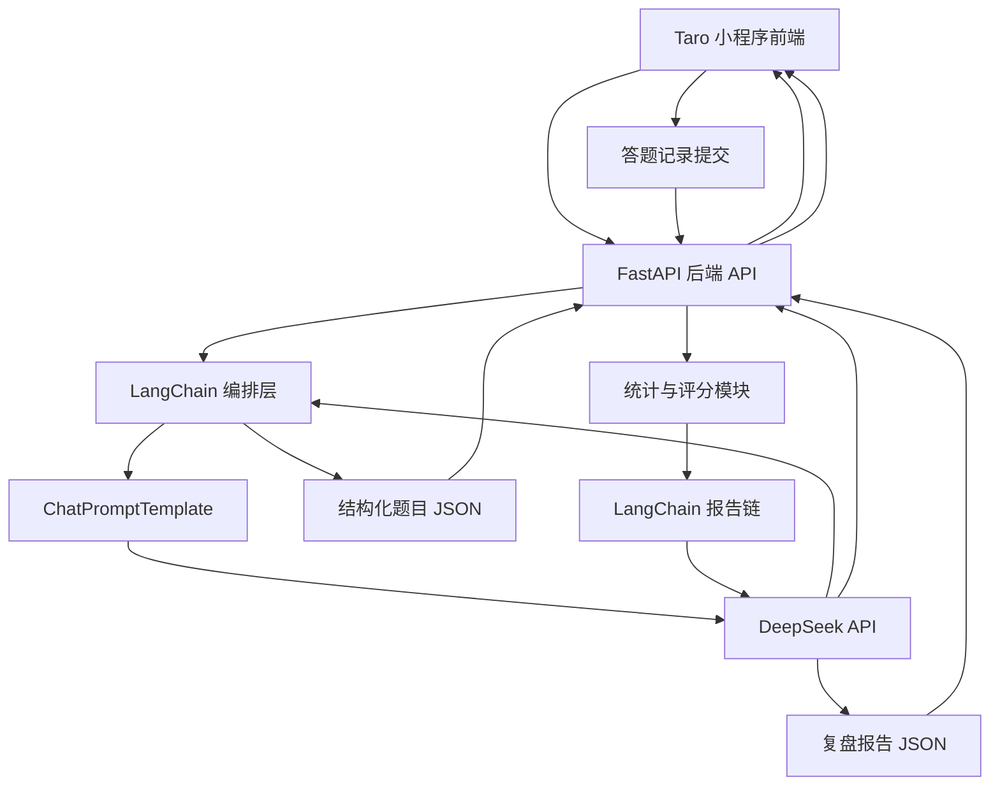

# 《智趣 AI 闯关学习小程序》方案设计文档

## 1. 文档目标

本文档用于指导“智趣 AI 闯关学习小程序”从 0 到 1 完成 MVP 方案设计与实施落地，重点解决以下问题：

1. 明确小程序前端技术选型，并给出可执行的推荐结论。
2. 围绕核心业务闭环设计整体架构：用户输入内容 => AI 生成题目 => 用户答题 => AI 生成分析报告。
3. 给出后端技术方案、核心 Prompt 设计、接口协议、领域数据模型和分阶段开发路径。
4. 对需求文档中的 todo 项进行收敛，区分“现在就做”和“后续再做”，避免前期工程失控。

本文档默认遵循以下前提：

- 后端语言采用 Python。
- 后端框架采用 FastAPI。
- 大模型采用 DeepSeek，优先使用 `deepseek-chat`。
- 大模型接入优先走 OpenAI 兼容 API。
- MVP 阶段不以联网搜索、用户系统、数据库建模、多模态为重点。
- MVP 的第一目标不是“功能全”，而是最短路径跑通核心学习闭环。

---

## 2. 需求收敛与 MVP 边界

### 2.1 产品目标

产品本质不是一个“传统题库系统”，而是一个“把任意输入知识快速转成闯关问答”的 AI 学习工具。用户价值主要来自三件事：

1. 降低学习材料处理门槛。
2. 通过问答闯关和即时讲解增强学习参与感。
3. 通过报告复盘形成学习闭环。

### 2.2 MVP 只保留的核心能力

结合需求文档与输出计划，MVP 只保留以下能力：

1. 用户输入一句话、一段文本或一个主题。
2. 后端调用 AI 生成 3 到 5 道题目，题型包含单选、多选、判断。
3. 用户逐题作答，提交后立即得到正确答案和详细讲解。
4. 全部题目完成后，系统生成知识总结、答题统计和复盘报告。

### 2.3 明确不前置的能力

以下能力保留在后续版本，不纳入 MVP 首轮开发：

1. 微信授权登录、用户注册、账号体系。
2. MySQL 正式库表设计与复杂持久化。
3. 网页抓取、PDF/Word/视频解析、联网搜索。
4. RAG 私有知识库、向量数据库。
5. 社交 PK、排行榜、分享裂变深度玩法。
6. 生图、语音、数字人等多模态能力。
7. 复杂商业化功能和支付链路。

### 2.4 方案设计原则

1. 先验证 AI 出题质量，再做外围系统。
2. 先做纯文本链路，再扩展多源输入。
3. 先做无状态或轻状态接口，再做用户中心。
4. 先保证题目结构化输出和解析稳定，再优化页面体验。
5. 所有设计以“单人独立开发、尽快上线验证”为第一约束。

---

## 3. 小程序技术选型对比

这是本项目最关键的技术决策之一。由于小程序生态更新很快，选型不能只看“理论能力”，而要看是否适合单人、快速交付、后续可扩展。

### 3.1 选型候选

本次重点比较以下四种方案：

1. 微信原生小程序
2. Taro
3. uni-app
4. uni-app x

### 3.2 对比维度

重点从以下维度比较：

- 学习与开发成本
- 微信小程序适配程度
- 多端扩展能力
- 生态成熟度
- 组件与插件可用性
- 性能与调试体验
- 对单人独立开发的友好度
- 对本项目 MVP 的适配程度

### 3.3 详细对比表

| 方案           | 技术栈                 | 优势                                                         | 劣势                                                         | 适合场景                                                     | 对本项目适配结论                   |
| -------------- | ---------------------- | ------------------------------------------------------------ | ------------------------------------------------------------ | ------------------------------------------------------------ | ---------------------------------- |
| 微信原生小程序 | WXML / WXSS / JS / TS  | 官方能力最完整，兼容性最好，微信特性接入最直接，问题定位最贴近平台 | 多端扩展差，工程化与组件生态相对分散，后续迁移 H5/App 成本高 | 只做微信单端、强依赖平台原生能力的项目                       | 不是首选，除非明确永远只做微信单端 |
| Taro 4.x       | React / Vue + Taro API | 开源、工程化成熟、对 VSCode 友好、多端扩展能力强，微信小程序/H5/RN 统一路径清晰，适合前后端分离项目 | 仍需理解小程序运行约束与跨端差异，首屏和组件细节需要按小程序思维处理 | 独立开发者或团队希望用现代前端工具链开发微信小程序，并保留后续扩展 H5 / RN 的空间 | 本项目推荐方案                     |
| uni-app        | Vue3 + uni API         | 对中文开发者友好，微信小程序落地成熟，插件生态丰富，Vue3 开发效率高，多端扩展能力强，学习成本低 | 更偏 DCloud 工具链和生态，部分资料与插件默认按 HBuilderX 路径组织，CLI 工作流的工程一致性不如 Taro 明确 | 单人或小团队，接受 DCloud 生态、优先追求快速上手的业务       | 可用，作为第二备选                 |
| uni-app x      | uts + uvue             | 面向未来的高性能跨端引擎，原生能力强，官方持续推进，已支持微信小程序 | 心智模型更重，需要理解 uts 与 uvue 约束，CSS 和生态兼容边界更多，且运行/发行工具链更依赖 HBuilderX | 高性能 App、多端统一原生化、愿意承担额外工程成本的团队       | 不适合作为当前 MVP 首发方案        |

### 3.4 最新调研结论

结合官方资料，可以得到以下关键判断：

1. `Taro 4.x` 仍然是当前开源跨端框架里非常稳妥的主流选择，支持 React / Vue，官方文档、社区案例和工程化能力都足够成熟。
2. 对本项目而言，`Taro 4.x` 更符合“VSCode 开发 + 微信开发者工具调试”的工作流，也更贴近现代前端工程体系。
3. `uni-app` 依然是可行方案，但如果目标明确是使用开源框架并弱化对 DCloud 工具链的依赖，`Taro` 更合适。
4. `uni-app x` 已经支持微信小程序，但它的核心价值更偏“高性能原生跨端”，工具链和心智成本都更重，不适合作为当前 MVP 的最低风险方案。
5. 微信原生虽然最稳定，但会限制未来扩展 H5 / RN / 其他小程序的路径，不利于该项目后续形成统一产品线。

### 3.5 最终推荐

**推荐结论：MVP 阶段采用 `Taro 4.x`。**

推荐理由如下：

1. 最符合“单人独立开发、最短时间交付”的约束。
2. `Taro 4.x` 是开源框架，便于坚持 `VSCode + CLI + 微信开发者工具` 的开发模式。
3. 微信小程序支持成熟，后续扩展 H5 或 RN 时保留更好的代码复用空间。
4. 更贴近现代前端工程体系，便于后续接入 ESLint、Prettier、测试和 CI。
5. 本项目前期重点不在极致性能，而在 AI 闭环验证，`Taro 4.x` 足够支撑。
6. 默认建议采用 `React + TypeScript` 方案；如果后续你明确想统一 Vue 生态，也可以切换到 `Taro Vue3`，但首版文档按 React 方案展开。

### 3.6 不推荐直接上 uni-app x 的原因

1. 当前 MVP 不是性能瓶颈型产品，不值得为了理论性能引入额外工程复杂度。
2. `uts` 和 `uvue` 的约束会增加学习和排障成本。
3. 对第三方 UI、NPM 生态和跨端样式约束的兼容判断更复杂。
4. 独立开发者第一阶段应该优先压缩变量，而不是引入下一代框架风险。

### 3.7 备选方案

如果你后续更希望降低学习成本，或者团队已有较多 Vue / uni-app 经验，则可以把 `uni-app Vue3` 作为第二推荐方案。

---

## 4. 整体系统架构设计

### 4.1 架构目标

整体架构必须满足三件事：

1. 前后端可以并行开发。
2. AI 生成结果必须结构化，前端不能依赖脆弱的文本解析。
3. 后续扩展输入源、RAG、用户系统时，不需要推翻当前核心模块。

### 4.2 总体架构图



### 4.3 核心模块拆分

前端模块：

1. 首页输入模块
2. 题目闯关模块
3. 即时反馈模块
4. 报告展示模块

后端模块：

1. 接口层：处理 HTTP 请求、参数校验、响应封装
2. 应用服务层：编排出题、评分、报告生成流程
3. LangChain 编排层：维护 Prompt 模板、输出 Schema 和调用链
4. AI 适配层：通过 LangChain 统一封装 DeepSeek 调用
5. 领域模型层：题目、选项、答题记录、报告等数据结构
6. 基础设施层：日志、配置、异常、限流、敏感词过滤

### 4.4 数据流设计

#### 流程一：生成题目

1. 用户在首页输入学习主题或一段文本。
2. 前端调用后端 `提交出题任务接口`，后端清洗输入并做敏感词与长度校验后，立即返回 `task_id`。
3. 后端在后台循环逐题调用 DeepSeek（每次只生成 1 道题），单题 JSON 更小、更不易截断，失败可单题重试。
4. 每生成并校验通过一道题，后端就更新该任务的进程内状态：`generated_count` 递增，题目追加进 `questions`。
5. 前端拿到 `task_id` 后每 1~2 秒轮询任务状态，一旦发现已生成第一道题，即进入闯关页开始答题。
6. 用户答题的同时，前端继续轮询拉取后续题目，直到任务状态变为 `done`；若为 `failed` 则提示重试。

> 说明：出题耗时约 15~30 秒，因此采用"提交任务 + 轮询进度"而非"一个请求同步等到底"，避免长时间白屏。方案细节见 9.4。

#### 流程二：用户答题

1. 前端展示题目与选项。
2. 用户选择答案后，前端本地比对正确答案并即时展示讲解。
3. 前端记录每题答题行为，包括答案、是否正确、用时。
4. 全部题目结束后，将本轮答题记录提交给后端。

#### 流程三：生成报告

1. 后端接收答题记录与原始题库。
2. 后端计算正确率、知识点掌握情况、薄弱点。
3. 后端通过 LangChain 报告链生成结构化复盘报告。
4. 前端渲染总结、正确率、知识建议和分享素材。

---

## 5. 技术栈设计

### 5.1 前端技术栈

- 框架：`Taro 4.x`
- 视图库：`React 18`
- 语言：`TypeScript`
- 状态管理：优先轻量方案，MVP 可使用 `Zustand` 或页面内状态
- 请求库：基于 `Taro.request` 的统一封装，或使用兼容良好的轻量请求层
- UI 策略：优先自定义轻量组件，不在 MVP 引入过重 UI 框架
- 构建工具：`Taro CLI + VSCode + 微信开发者工具`

### 5.2 后端技术栈

- Web 框架：`FastAPI`
- 运行环境：`Python 3.11+`
- 数据校验：`Pydantic v2`
- 模型编排框架：`LangChain`
- LangChain 模型适配：`langchain-openai`
- Prompt 模板：`ChatPromptTemplate`
- 结构化输出：`with_structured_output()` + `Pydantic`
- 配置管理：`pydantic-settings`
- 日志：`structlog` 或标准 logging
- 测试：`pytest`

### 5.3 为什么选 FastAPI

1. 参数校验与文档能力强，适合快速定义 AI 接口。
2. 天然生成 OpenAPI 文档，便于前后端并行联调。
3. 异步友好，后续接入解析任务、异步报告生成更平滑。
4. 对单人开发效率很高，工程心智负担低于传统框架组合。

### 5.4 为什么使用 LangChain 作为正式接入层

结合 LangChain 官方文档，本项目应当把 LangChain 作为 DeepSeek 的正式接入层，而不是仅作为可选辅助库。

推荐原因：

1. LangChain 官方推荐使用 `ChatPromptTemplate` 组织系统消息和用户消息，这比拼接长字符串 Prompt 更稳定、更易维护。
2. LangChain 官方提供结构化输出能力，可以直接把模型返回结果约束到 `Pydantic` Schema，适合本项目的题库 JSON 和报告 JSON 场景。
3. `langchain-openai` 的 `ChatOpenAI` 支持通过 `base_url` 和 `api_key` 对接 OpenAI 兼容接口，因此可以直接接 DeepSeek。
4. 把模型调用统一放在 LangChain 层，后续切换模型、增加重试、增加输出解析和引入 RAG 时，扩展路径更清晰。

使用边界也需要明确：

1. MVP 中使用 LangChain 的 `ChatPromptTemplate`、`ChatOpenAI`、`with_structured_output()`。
2. 不在首版引入 Agent、复杂工具调用、LangGraph 或重型 RAG 编排。
3. LangChain 是正式编排层，但仍要保留清晰的服务层与异常处理，不能把所有逻辑堆进链定义中。

结论是：**LangChain 是本项目对接 DeepSeek 的正式方案，但首版仅使用其稳定的 Prompt 与结构化输出能力。**

---

## 6. 后端架构设计

### 6.1 推荐项目结构

```text
backend/
  app/
    api/
      v1/
        routes/
          health.py
          quiz.py
          report.py
    core/
      config.py
      logging.py
      exceptions.py
      security.py
    models/
      quiz.py
      report.py
      common.py
    services/
      quiz_service.py
      report_service.py
      scoring_service.py
    prompts/
      quiz_prompt.py
      report_prompt.py
    llm/
      langchain_factory.py
      quiz_chain.py
      report_chain.py
      output_schemas.py
    utils/
      text_cleaner.py
      content_filter.py
      id_generator.py
    main.py
  tests/
    test_quiz_api.py
    test_report_api.py
    test_prompt_contract.py
  requirements.txt
```

### 6.2 分层职责

#### API 层

负责：

1. 请求参数校验
2. 返回码和响应格式统一
3. 错误码映射
4. 接口级日志记录

#### Service 层

负责：

1. 调用 LangChain 出题链或报告链
2. 组织输入参数并触发模型编排
3. 做 JSON 结果兜底校验
4. 组装业务响应对象

#### LLM 层

负责：

1. 基于 `langchain-openai` 初始化 DeepSeek 对应的 `ChatOpenAI`
2. 统一管理模型、温度、超时、重试配置
3. 通过 `ChatPromptTemplate` 和 `with_structured_output()` 生成可复用调用链
4. 统一处理模型空响应、格式异常、截断风险

#### Prompt 层

负责：

1. 维护版本化 Prompt 模板
2. 维护结构化输出 Schema
3. 提高出题质量一致性
4. 为未来 A/B Test 预留扩展点

---

## 7. DeepSeek 接入方案

### 7.1 模型选择

MVP 推荐：

- 首选：`deepseek-chat`
- 预留：`deepseek-reasoner`

推荐理由：

1. 出题与报告生成更关注稳定输出和成本平衡。
2. `deepseek-chat` 更适合标准化内容生成。
3. `deepseek-reasoner` 可作为高难题或复杂分析的后续增强能力，而不是 MVP 必需项。

### 7.2 接入方式

使用 `LangChain + langchain-openai` 对接 DeepSeek 的 OpenAI 兼容接口，推荐方式如下：

- 使用 `ChatOpenAI`
- `base_url = https://api.deepseek.com`
- `api_key = DEEPSEEK_API_KEY`
- `model = deepseek-chat`
- 通过 `ChatPromptTemplate` 构建消息模板
- 通过 `with_structured_output()` 约束输出到 `Pydantic` 模型

推荐代码形态：

```python
from langchain_openai import ChatOpenAI
from langchain_core.prompts import ChatPromptTemplate

llm = ChatOpenAI(
  model="deepseek-chat",
  base_url="https://api.deepseek.com",
  api_key="${DEEPSEEK_API_KEY}",
  temperature=0.4,
)

prompt = ChatPromptTemplate.from_messages(
  [
    ("system", "你是一名专业的 AI 学习教练。"),
    ("user", "{user_input}"),
  ]
)
```

### 7.3 JSON 输出策略

根据 DeepSeek 和 LangChain 官方文档，结构化输出建议按以下策略落地：

1. LangChain 层优先使用 `with_structured_output()` 约束输出 Schema。
2. Prompt 中仍然明确要求输出 JSON 语义，并给出目标字段结构。
3. DeepSeek 底层保持 OpenAI 兼容调用方式，必要时补充 `response_format` 约束。
4. `max_tokens` 要保守设置，防止结构体被截断。
5. 输出结果进入服务层后，仍需做字段完整性校验，不能只依赖模型侧保证。

### 7.4 可靠性设计

出题链路必须增加以下兜底：

1. 一级校验：检查返回内容是否为空。
2. 二级校验：检查 LangChain 结构化输出是否成功映射到 Schema。
3. 三级校验：检查字段是否完整，例如题目数、选项数、答案格式。
4. 四级校验：若失败，自动重试 1 到 2 次，并切换到更保守 Prompt。
5. 五级兜底：若仍失败，返回“生成失败，请重试”而不是把脏数据交给前端。

### 7.5 调用参数建议

出题接口建议：

- temperature: `0.4`
- top_p: `0.9`
- timeout: `30s`
- max_tokens: 根据题量控制在合理范围
- LangChain Runnable 超时与重试策略统一在模型工厂层配置

报告接口建议：

- temperature: `0.5`
- top_p: `0.9`
- timeout: `30s`
- 通过独立的报告链复用相同模型工厂配置

---

## 8. 核心 Prompt 设计

Prompt 设计直接决定 MVP 体验质量。首版不要追求花哨，要优先追求“稳定、结构化、可解析”。

### 8.1 出题 Prompt 目标

要求模型基于用户输入生成可直接渲染的题库 JSON，题目应覆盖：

1. 核心概念理解
2. 易错点辨析
3. 应用场景判断

### 8.2 出题 Prompt 设计原则

1. 明确题量，例如 5 题。
2. 明确题型比例，例如单选 3、多选 1、判断 1。
3. 明确输出字段。
4. 明确讲解必须通俗、简洁、适合小程序阅读。
5. 明确禁止输出 Markdown、额外说明、代码块。

### 8.3 出题 Prompt 示例

```text
你是一名专业的 AI 学习教练，请根据用户提供的学习内容生成一组用于小程序闯关答题的题目。

要求：
1. 输出必须是合法 JSON，不要输出任何 JSON 之外的内容。
2. 题目总数为 5 题。
3. 题型包含：3 道单选题、1 道多选题、1 道判断题。
4. 每道题必须包含：题目编号、题型、题干、选项、正确答案、详细讲解、知识点标签、难度。
5. 讲解必须适合初学者阅读，避免过度学术化。
6. 如果用户输入内容过短，可以基于常识进行合理补充，但不要偏离主题。

JSON 输出结构示例：
{
  "title": "学习主题",
  "summary": "本次题库的主题摘要",
  "questions": [
    {
      "id": "q1",
      "type": "single",
      "stem": "题干",
      "options": [
        {"key": "A", "text": "选项A"},
        {"key": "B", "text": "选项B"}
      ],
      "answer": ["A"],
      "explanation": "详细讲解",
      "knowledge_point": "知识点",
      "difficulty": "easy"
    }
  ]
}

用户学习内容如下：
{user_input}
```

### 8.4 报告 Prompt 目标

输入原始主题、题库、用户作答记录，输出结构化复盘报告。

### 8.5 报告 Prompt 输出内容

1. 本次正确率
2. 掌握较好的知识点
3. 薄弱知识点
4. 三句知识总结
5. 后续建议
6. 一句可用于分享的学习金句

### 8.6 报告 Prompt 示例

```text
你是一名学习复盘教练，请根据用户本次闯关答题记录生成一份结构化复盘报告。

要求：
1. 输出必须是合法 JSON。
2. 语言风格清晰、鼓励式，但不要空泛。
3. 分析应基于用户真实答题情况，不要编造未出现的结论。
4. 总结要适合移动端阅读。

JSON 输出结构示例：
{
  "accuracy": 80,
  "mastered_points": ["知识点1"],
  "weak_points": ["知识点2"],
  "three_line_summary": ["一句话1", "一句话2", "一句话3"],
  "advice": ["建议1", "建议2"],
  "share_quote": "今天我又闯过一个知识关卡"
}

用户主题：{topic}
题库数据：{quiz_json}
答题记录：{answer_records}
统计结果：{score_summary}
```

### 8.7 Prompt 版本管理建议

建议从一开始就做版本化：

- `quiz_prompt_v1`
- `quiz_prompt_v2`
- `report_prompt_v1`

这样后续优化模型输出时，不会影响接口调用方和测试基线。

---

## 9. API 接口设计

MVP 接口必须做到足够简单，让前后端并行开发不互相等待。

### 9.1 接口列表

#### 1. 健康检查

- `GET /api/v1/health`

用途：

- 检查后端服务是否启动

#### 2. 生成题库（异步任务式）

由于一次出题需要 15~30 秒，生成题库不采用“一个请求同步等到底”的方式，而是拆成“提交任务 + 轮询进度”两个接口（设计原理见 9.4）。

**2.1 提交出题任务**

- `POST /api/v1/quiz/generate`

请求体示例：

```json
{
  "user_input": "我想学习什么是 RAG，以及它和传统搜索有什么区别",
  "question_count": 5,
  "difficulty": "mixed"
}
```

响应体示例（立即返回，不等待生成完成）：

```json
{
  "task_id": "task_xxx",
  "status": "pending"
}
```

**2.2 轮询出题进度**

- `GET /api/v1/quiz/task/{task_id}`

响应体示例（生成中，已出 2 道题）：

```json
{
  "task_id": "task_xxx",
  "status": "generating",
  "generated_count": 2,
  "total": 5,
  "quiz_id": "quiz_xxx",
  "title": "RAG 入门闯关",
  "summary": "围绕 RAG 基础概念与应用场景生成的题库",
  "questions": []
}
```

`status` 取值：`pending`（已创建待开始）/ `generating`（生成中）/ `done`（全部完成）/ `failed`（失败，可重试）。前端每 1~2 秒轮询一次，`generated_count >= 1` 即可跳转闯关页，`status == "done"` 时停止轮询。

> 兼容说明：如需最简的同步调试接口，可额外保留一个 `POST /api/v1/quiz/generate/sync`，一次性返回完整题库，仅用于后端联调与压测，不用于正式前端链路。

#### 3. 生成复盘报告

- `POST /api/v1/report/generate`

请求体示例：

```json
{
  "quiz_id": "quiz_xxx",
  "topic": "RAG 入门",
  "questions": [],
  "answer_records": [
    {
      "question_id": "q1",
      "selected_answers": ["A"],
      "is_correct": true,
      "duration_ms": 3200
    }
  ]
}
```

响应体示例：

```json
{
  "accuracy": 80,
  "mastered_points": ["RAG 的基本定义"],
  "weak_points": ["RAG 与搜索引擎的边界"],
  "three_line_summary": ["...", "...", "..."],
  "advice": ["...", "..."],
  "share_quote": "把知识做成关卡，记忆会更深。"
}
```

### 9.2 为什么不单独设计“提交单题答案接口”

MVP 阶段不建议把每道题都交给后端判题，原因如下：

1. 正确答案已在题库 JSON 中，前端可以即时反馈。
2. 单题提交会增加接口复杂度和网络等待。
3. 当前核心目标是验证题目质量和报告质量，不是做实时对战。

更合理的做法是：

1. 前端本地即时判题并展示讲解。
2. 全部题目结束后一次性提交作答记录生成报告。

### 9.3 统一响应规范

建议后端统一返回结构：

```json
{
  "code": 0,
  "message": "ok",
  "data": {}
}
```

错误时：

```json
{
  "code": 4001,
  "message": "题库生成失败，请稍后重试",
  "data": null
}
```

### 9.4 异步出题与进度反馈设计（MVP 采用轮询）

出题耗时较长（约 15~30 秒），必须给用户明确的进度反馈，否则长时间白屏会直接劝退。业界常见两种做法，本项目 MVP **选择轮询**，原因如下。

#### 9.4.1 两种方案对比

| 方案 | 实现方式 | 优点 | 缺点 | 结论 |
| ---- | -------- | ---- | ---- | ---- |
| 轮询（Polling） | 后端循环单题生成并写入任务状态，前端每 1~2 秒查一次进度 | 实现极简，就是普通 `Taro.request`，无任何小程序端适配 | 有轻微延迟（1~2 秒粒度） | **MVP 采用** |
| SSE（Server-Sent Events） | 后端事件流逐题推送，前端 `enableChunked` + `onChunkReceived` 接收 | 实时性最好 | 微信小程序需大量适配（见 9.4.4） | P2 可选，暂不做 |

关键判断：**SSE 的优势场景是“逐字吐”的长文本（如聊天逐字输出），而本项目是“逐题出”的离散内容**——5 道题分散在 20 秒内产出，平均每 4 秒一道。这种颗粒度下，1~2 秒轮询与 SSE 的体感几乎无差别，却省掉了小程序端全部适配成本。因此 MVP 用轮询，收益/成本比最高。

#### 9.4.2 后端设计

1. 提交任务：`POST /api/v1/quiz/generate` 创建任务、生成 `task_id`，用后台任务（`FastAPI BackgroundTasks` 或 `asyncio.create_task`）启动出题，立即返回。
2. 循环单题生成：后端按目标题量循环调用 DeepSeek，**每次只生成 1 道题**。单题 JSON 体积小，截断风险低；某道失败可单独重试，不会一崩崩一整批（与 7.4 可靠性设计一致）。
3. 更新任务状态：每成功生成并通过 Pydantic 校验一道题，就更新进程内任务状态（`generated_count += 1`，题目追加进 `questions`）。
4. 结束：全部完成置 `status = "done"`；若连续重试仍失败则置 `status = "failed"` 并记录错误原因。

任务状态对象（进程内，MVP 无需数据库）：

```json
{
  "task_id": "task_xxx",
  "status": "generating",
  "generated_count": 2,
  "total": 5,
  "quiz_id": "quiz_xxx",
  "title": "RAG 入门闯关",
  "summary": "...",
  "questions": [],
  "error": null,
  "created_at": 1700000000
}
```

> 实现提示：任务状态用一个进程内字典 `dict[task_id, TaskState]` 保存即可，建议加 TTL（如 30 分钟）定期清理，防止内存无限增长。单机单进程部署下无需 Redis；将来多进程/多实例时再换 Redis 或数据库。

#### 9.4.3 前端设计（Taro）

1. 首页点击“开始生成”后调用提交接口，拿到 `task_id`。
2. 用定时器每 1~2 秒调用 `GET /api/v1/quiz/task/{task_id}`。
3. 一旦 `generated_count >= 1`，立即跳转闯关页并展示第一题，用户即可开始答题。
4. 闯关页继续轮询，把新到的题目追加进本地题目列表；`status == "done"` 时停止轮询。
5. `status == "failed"` 时停止轮询并提示重试；轮询设置最大次数/超时兜底，避免无限轮询。

#### 9.4.4 SSE 方案的适配成本（P2 备查，MVP 不实现）

若未来确有“逐字输出”需求（如报告逐字生成）再引入 SSE，届时需处理以下微信小程序端的坑：

1. 小程序不支持 `EventSource`，必须用 `wx.request({ enableChunked: true, responseType: 'arraybuffer' })` + `requestTask.onChunkReceived`。
2. 真机不支持 `TextDecoder`，需手写 UTF-8 解码。
3. 分块边界可能把多字节汉字切成半个，需维护跨 chunk 的字节缓冲区再解码。
4. 一个 SSE 帧可能跨多个 chunk，需按 `\n\n` 做粘包/拆包处理。

这些正是 MVP 阶段选择轮询、把 SSE 后置的直接原因。

---

## 10. 领域数据模型设计

本节先定义业务对象，不展开正式库表设计。

### 10.1 Quiz

```json
{
  "quiz_id": "quiz_xxx",
  "title": "字符串",
  "summary": "字符串",
  "source_type": "text",
  "user_input": "原始输入",
  "questions": []
}
```

### 10.2 Question

```json
{
  "id": "q1",
  "type": "single|multiple|judge",
  "stem": "题干",
  "options": [
    {"key": "A", "text": "选项A"}
  ],
  "answer": ["A"],
  "explanation": "详细讲解",
  "knowledge_point": "知识点标签",
  "difficulty": "easy|medium|hard"
}
```

### 10.3 AnswerRecord

```json
{
  "question_id": "q1",
  "selected_answers": ["A"],
  "is_correct": true,
  "duration_ms": 3200
}
```

### 10.4 Report

```json
{
  "accuracy": 80,
  "mastered_points": ["..."],
  "weak_points": ["..."],
  "three_line_summary": ["...", "...", "..."],
  "advice": ["...", "..."],
  "share_quote": "..."
}
```

### 10.5 MVP 阶段存储策略

MVP 推荐按以下顺序实现：

1. 第一阶段：无数据库，出题任务状态放在后端进程内字典（带 TTL 清理），题库随任务返回给前端持有，报告按需生成。
2. 第二阶段：后端把题库和报告落地到本地 JSON 文件或 SQLite，便于调试；进程内任务状态可平滑替换为持久化实现。
3. 第三阶段：接入 MySQL，设计正式用户、题库、答题记录、报告表；多实例部署时任务状态改用 Redis。

这比一开始就上 MySQL 更符合当前项目节奏。

---

## 11. 前端页面与交互设计

你已经明确前期不重点展开 UI 方案，因此这里只保留对开发有帮助的最小页面设计。

### 11.1 页面列表

1. 首页 `pages/index/index`
2. 闯关页 `pages/quiz/index`
3. 报告页 `pages/report/index`

### 11.2 首页

功能：

1. 输入主题或文本
2. 点击“开始生成”，提交出题任务拿到 `task_id`
3. 展示出题进度（轮询任务状态，显示“已生成 N/总数”而非单纯转圈）
4. 一旦生成出第一道题即可跳转闯关页开始答题，无需等全部生成完
5. 失败重试

### 11.3 闯关页

功能：

1. 展示当前题目与进度
2. 支持单选、多选、判断
3. 用户提交后立即展示对错与讲解
4. 展示经验值、答题正确数、剩余题数

### 11.4 报告页

功能：

1. 展示正确率
2. 展示三句知识总结
3. 展示掌握点与薄弱点
4. 展示复习建议
5. 预留分享海报按钮

### 11.5 交互原则

1. 单题反馈必须即时，不要要求用户全部做完才知道对错。
2. 每道题讲解内容必须可折叠，避免页面过长。
3. AI 出题过程要给明确的进度反馈（轮询展示“已生成 N/总数”），首题就绪即可进入答题，尽量减少纯等待时间。
4. 页面状态以简单清晰为主，不要前期加入复杂动画和排行榜干扰主流程。

---

## 12. 核心业务流程与开发思路

### 12.1 MVP 实施顺序

正确顺序应该是：

1. 先把后端 `生成题库接口` 跑通。
2. 再做前端闯关页面。
3. 再做报告生成接口。
4. 最后把首页接入，形成端到端闭环。

而不是一开始就做：

1. 用户系统
2. 数据库
3. 分享海报
4. 多端适配细节

### 12.2 为什么必须先验证 AI 出题接口

因为这个项目的核心不是“题目展示页面”，而是“AI 是否能稳定生成可玩、可讲解、可复盘的结构化题库”。

如果这一步不稳定，后面的页面、账户、数据库都没有实际价值。

### 12.3 推荐验证顺序

#### Step 1

用 Postman 或 Swagger 调通同步调试接口 `POST /api/v1/quiz/generate/sync`（先不引入异步与轮询，专注验证出题质量）。

验收标准：

1. 返回结构稳定。
2. 题目质量可接受。
3. 讲解清晰。
4. 失败可兜底。

#### Step 2

前端拿静态 JSON 先做闯关页。

验收标准：

1. 单选、多选、判断能正确渲染。
2. 答题后能立刻反馈。
3. 多题切换流程顺畅。

#### Step 3

接入真实生成题库接口。

验收标准：

1. 首页输入后能正常跳到闯关页。
2. 题目数据显示正确。

#### Step 4

完成 `POST /api/v1/report/generate`。

验收标准：

1. 报告能根据答题结果变化。
2. 总结与建议不是模板废话。

---

## 13. 分阶段开发计划

### Phase 0：环境搭建

目标：

- 建立前后端基础工程
- 接通 DeepSeek API
- 确定目录结构与代码规范

交付物：

1. `Taro 4.x` 前端初始化项目
2. `FastAPI` 后端初始化项目
3. `.env` 配置与基础日志
4. 健康检查接口

### Phase 1：后端 AI 出题接口

目标：

- 优先验证最核心的 AI 能力

交付物：

1. 同步调试接口 `POST /api/v1/quiz/generate/sync`（先用它专注验证 AI 出题质量，逻辑最简）
2. 出题 Prompt V1
3. DeepSeek 单题循环生成 + JSON 输出解析与重试机制
4. 题库 JSON 校验逻辑

验收：

1. 连续生成 10 次，结构稳定。
2. 至少 80% 以上输出可直接用于前端渲染。

### Phase 2：异步出题接口 + 小程序闯关页

目标：

- 把出题改造成异步任务式，接入轮询进度反馈
- 完成答题流程和即时讲解交互

交付物：

1. 异步接口：`POST /api/v1/quiz/generate`（提交任务返回 `task_id`）+ `GET /api/v1/quiz/task/{task_id}`（轮询进度）
2. 进程内任务状态存储（含 `generated_count` / `status`，带 TTL 清理）
3. 首页输入页（轮询进度、首题就绪即跳转）
4. 闯关页（边答边轮询拉取后续题目）
5. 本地判题逻辑
6. XP / 进度条基础 UI

验收：

1. 首题在数秒内可进入答题，不出现长时间白屏。
2. 后续题目在答题过程中陆续到位，`done` 后停止轮询。
3. `failed` 有明确重试提示，轮询有超时兜底。

### Phase 3：报告生成

目标：

- 打通答题结束后的复盘闭环

交付物：

1. `POST /api/v1/report/generate`
2. 报告 Prompt V1
3. 报告展示页

### Phase 4：完整闭环联调

目标：

- 打通从输入到报告的完整链路

交付物：

1. 首页调用生成题库接口
2. 闯关页承接真实数据
3. 报告页展示真实 AI 结果
4. 异常态与空态处理

### Phase 5：增强能力

目标：

- 在闭环稳定后再扩展外围能力

候选交付物：

1. 分享海报
2. 本地持久化或 MySQL
3. 微信登录
4. 多源输入
5. 错题本和复习提醒

---

## 14. 风险与合规提示

### 14.1 上线合规（未来阻塞项，当前本地开发不受影响）

本项目属于“AI 问答 / 深度合成”类应用，正式上线微信小程序时有一条硬性门槛，需提前知晓，避免开发到后期才发现无法发布：

1. **类目限制**：微信【深度合成 - AI 问答】服务类目**仅对非个人主体（企业/组织/个体工商户等）开放，个人主体小程序无法申请**。未添加该类目的 AI 小程序在代码审核阶段会被直接驳回。
2. **备案材料**：申请该类目需提供技术主体的《互联网信息服务算法备案》（生成合成类）截图，以及主体与算法备案方的合作协议。可自研备案，或使用已备案的大模型服务方（如微信云开发、百炼、火山方舟等）提供的合作协议。
3. **正式环境要求**：小程序正式环境要求后端为 HTTPS + 已备案域名；开发期可在微信开发者工具勾选“不校验合法域名”直连本地后端。

> 结论：当前阶段先跑通本地核心链路即可，不阻塞开发。但若计划正式上线，需尽早规划企业主体注册与算法备案，这两项周期较长。

### 14.2 内容安全

AI 生成内容与用户输入均需做合规过滤。除文档已提到的输入侧敏感词校验外，上线前建议在服务端接入微信 `security.msgSecCheck`（文本内容安全识别，须服务端调用）对“用户输入”和“AI 生成的题目/讲解”做二次检测，命中风险则拦截或替换。

### 14.3 AI 输出稳定性

出题/报告依赖大模型输出，存在格式异常、字段缺失、截断风险。缓解措施已在 7.4、9.4 落地：单题循环生成降低截断概率、Pydantic 结构化校验 + 失败重试、最终兜底返回“生成失败请重试”而非脏数据。

### 14.4 成本控制

出题为高输出 token 场景，需关注调用成本。建议：对相同输入做结果缓存、限制单次题量与 `max_tokens`、对单用户/单 IP 做频率限制（MVP 可用简单内存计数），并保留切换到更低价模型的配置位。