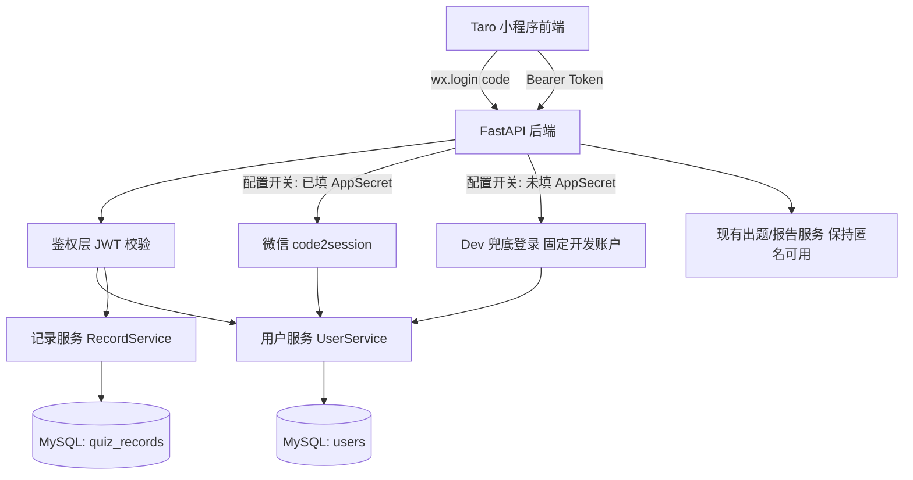
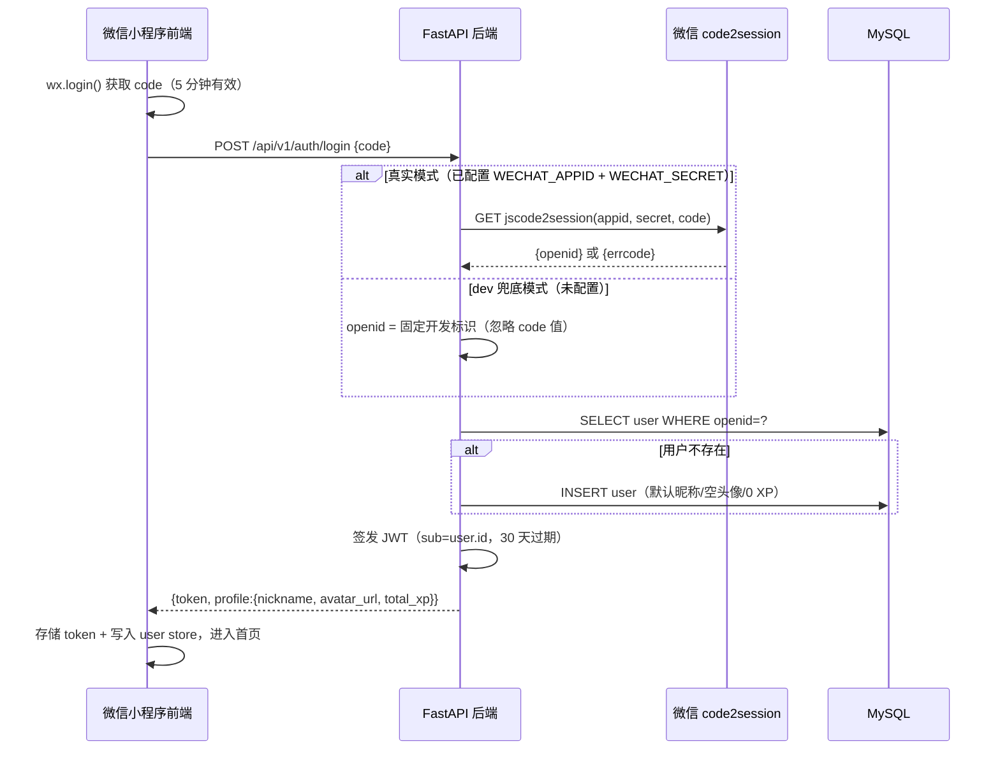

# 《智趣 AI 闯关学习小程序》用户系统扩展 · 方案设计文档

> 本文档是《用户系统需求分析文档.md》的配套**方案设计**，覆盖批次一~批次四（微信登录与鉴权、用户信息、闯关记录落库与 XP、历史与统计展示）的全部技术方案。
> 关联文档：`需求分析文档.md`（总需求）、`《智趣 AI 闯关学习小程序》方案设计文档.md`（核心 MVP 方案）、`用户系统需求分析文档.md`（本次需求的“做什么”）、`prototypes/`（UI 原型 v1.2）。
> 状态：**待人工确认**。确认前不启动开发。

---

## 1. 文档目标与前提

### 1.1 文档目标

1. 把用户系统需求落成可执行的技术方案：数据库表设计、接口协议、登录鉴权实现、前后端改造点、分阶段开发路径。
2. 对需求文档中的待确认项（XP 计算口径等）给出收敛结论与理由。
3. 保证方案与现有 MVP 代码结构无缝衔接，新增能力以“最小侵入”方式接入。

### 1.2 既定前提

- 后端沿用现有技术栈：Python 3.11+ / FastAPI / Pydantic v2 / pydantic-settings。
- 前端沿用现有技术栈：Taro 4.x / React 18 / TypeScript / Zustand。
- 数据持久化采用 MySQL（需求 §1.3 已确认）。
- 登录采用“真实架构 + 配置开关”：`wx.login → code → 后端签发 Token`，未配置 AppSecret 时走 dev 兜底登录（需求 §1.3 已确认）。
- UI 只改动原型已覆盖界面：登录页（S1）、首页“最近闯关”、“我的”页，不新增页面。
- 任何设计不得破坏匿名用户（“先逛逛”）的核心闯关闭环。

### 1.3 现状代码基线（方案的事实依据）

以下结论来自对现有代码的核实，方案在其上扩展：

后端：

1. 统一响应 `{code, message, data}`，非 0 即业务错误（[response.py](../backend/app/api/response.py)）。
2. 统一异常 `AppException(code, message, http_status=200)`，已有错误码 4001/4002/4004/5000/5001/5002（[exceptions.py](../backend/app/core/exceptions.py)）。
3. 路由集中在 `app/api/v1/routes/`，前缀 `/api/v1`；依赖注入集中在 [deps.py](../backend/app/api/deps.py)，测试用 `dependency_overrides` 注入 mock。
4. 配置集中在 `app/core/config.py`（pydantic-settings）；`.env.example` 已预留 `DB_HOST`/`DB_PORT`/`DB_USER`/`DB_PASSWORD`/`DB_NAME`、`WECHAT_APPID`、`WECHAT_SECRET`、`JWT_SECRET`、`JWT_EXPIRE_DAYS`。
5. [scoring_service.py](../backend/app/services/scoring_service.py) 已实现后端独立判题与统计复算（`judge_answer` / `compute_score_summary`），可直接作为 XP 服务端权威计算的基础。
6. 敏感词校验 [content_filter.py](../backend/app/utils/content_filter.py) 可复用于昵称等 UGC 文本。

前端：

1. 统一请求封装 [request.ts](../frontend/src/services/request.ts)：解包 `{code,message,data}`，非 0 抛 `ApiError`。
2. 本地存储 [storage.ts](../frontend/src/services/storage.ts)：`recent_quizzes`（最近闯关）与 `total_xp`（累计 XP），是匿名态的数据回退层。
3. 结算写入点在答题页：报告生成成功后调用 `addRecentQuiz` + `addTotalXp`（[quiz/index.tsx](../frontend/src/pages/quiz/index.tsx)），XP 口径为前端 `XP_PER_CORRECT = 10`（[store/quiz.ts](../frontend/src/store/quiz.ts)），星级口径为 `max(1, round(accuracy/100*5))`。
4. 登录页为占位实现（toast + 跳首页），“先逛逛”为匿名入口；“我的”页昵称占位为“学习小达人”。

---

## 2. 需求收敛与设计原则

### 2.1 本次方案覆盖范围

| 批次 | 主题 | 方案章节 |
| --- | --- | --- |
| 批次一（P0） | 用户登录与鉴权 | §5、§9、§10 |
| 批次二（P0） | 用户信息获取与展示 | §6、§9、§10 |
| 批次三（P1） | 闯关记录落库与 XP 同步 | §7、§9、§10 |
| 批次四（P1） | 闯关历史与统计展示 | §8、§9、§10 |

数据库、配置、安全、测试为贯穿设计，见 §4、§11、§12、§13。

### 2.2 明确不做（沿用需求 §1.4）

错题本、艾宾浩斯复习、学习分析看板、社交 PK / 排行榜 / 付费，均不在本次范围。库表与接口设计**不为其预留复杂结构**，仅在 §4.5 说明未来扩展路径。

### 2.3 设计原则

1. **服务端权威**：登录态下 XP、历史、统计以服务端为唯一口径，端上只做展示。
2. **匿名兼容**：匿名用户完整走现有本地逻辑；后端现有出题/报告接口不增加强制鉴权。
3. **配置开关**：真实登录 / dev 兜底登录由配置切换，业务代码零改动。
4. **最小侵入**：新增模块、新增路由、新增依赖为主；对现有文件的改动点逐一列明（§10）。
5. **幂等与事务**：通关结算必须防重复写入、防重复加 XP（需求 §5.2）。
6. **单人可交付**：优先简单可靠的同步方案，不引入非必需中间件（不用 Redis、不用消息队列、本期不引入 Alembic）。

---

## 3. 总体架构设计

### 3.1 总体架构图



### 3.2 核心链路说明

1. 登录链路：小程序 `wx.login` 拿 `code` → `POST /auth/login` → 后端按配置开关换取或伪造用户标识 → 查库/建档 → 签发 JWT → 前端持有 Token。
2. 受保护链路：前端请求自动携带 `Authorization: Bearer <token>` → 后端鉴权依赖解析出当前用户 → 服务层按用户读写 MySQL。
3. 结算链路（登录态）：答题完成 → 生成报告（现有接口，不变）→ 调用 `POST /quiz/records` → 服务端复算成绩、同一事务内写记录 + 累加 XP → 返回权威总 XP。
4. 匿名链路：与现状完全一致（本地 `storage.ts`），后端无写入。

### 3.3 后端目录结构演进

```text
backend/
  app/
    api/
      v1/routes/
        health.py              # 现有
        quiz.py                # 现有（不改鉴权行为）
        report.py              # 现有（不改鉴权行为）
        auth.py                # 新增：登录
        user.py                # 新增：资料/头像/统计
        records.py             # 新增：闯关记录
      deps.py                  # 扩展：get_db / get_current_user / get_optional_user
    core/
      config.py                # 扩展：数据库/微信/JWT/上传配置
      security.py              # 新增：JWT 签发与校验
      exceptions.py            # 扩展：4010/4011 等错误码
    db/                        # 新增包
      base.py                  # SQLAlchemy Base
      session.py               # engine / SessionLocal / get_db / init_db
      orm_models.py            # User / QuizRecord ORM 映射
    models/                    # 现有 Pydantic DTO 包
      user.py                  # 新增：UserProfile / LoginResult 等
      record.py                # 新增：QuizRecordIn / QuizRecordOut / UserStats
    services/
      auth_service.py          # 新增：code2session / dev 登录 / upsert 用户
      user_service.py          # 新增：资料读写、头像落盘
      record_service.py        # 新增：记录写入（幂等+事务）、历史查询、统计
      scoring_service.py       # 现有：复算正确数/正确率（直接复用）
    utils/
      content_filter.py        # 现有：昵称敏感词校验复用
  tests/
    test_auth.py               # 新增
    test_user_api.py           # 新增
    test_records.py            # 新增
```

### 3.4 前端目录结构演进

```text
frontend/src/
  services/
    request.ts      # 改造：自动携带 Token、4010 统一处理
    auth.ts         # 新增：Token 存取、wx.login 封装、登录/静默重登
    api.ts          # 扩展：login / getProfile / updateProfile / uploadAvatar / submitRecord / getRecords / getStats
    storage.ts      # 保留：匿名态数据回退层（定位变化见 §10.6）
  store/
    user.ts         # 新增：登录态 + 当前用户资料（Zustand）
    quiz.ts         # 改造：结算时生成 client_record_id
  pages/
    login/index.tsx       # 改造：真实登录
    index/index.tsx       # 改造：最近闯关按登录态切换数据源
    profile/index.tsx     # 改造：资料/统计/历史接服务端 + 登录引导 + 行内编辑
    quiz/index.tsx        # 改造：结算分支（登录→服务端，匿名→本地）
  app.tsx                 # 改造：启动时恢复登录态
```

---

## 4. 数据库设计（MySQL）

### 4.1 技术选型结论

| 决策点 | 结论 | 理由 |
| --- | --- | --- |
| ORM | SQLAlchemy 2.x（同步）+ PyMySQL | 与 FastAPI 生态成熟配合；同步模型心智成本最低，本项目并发量下足够；异步 driver（asyncmy）留作后续优化项 |
| 建表方式 | 应用启动时 `Base.metadata.create_all` 自动建表 | 与 `.env.example` 注释约定一致；需求明确“库需提前存在，表可由程序自动创建” |
| 迁移工具 | 本期不引入 Alembic | 表结构全新、无历史数据；字段变更少，手动 `ALTER` 成本低于引入迁移工具；表结构稳定后再补 Alembic |
| 连接管理 | 请求级 Session（`Depends(get_db)`，用完关闭） | FastAPI 标准模式，天然配合现有 `deps.py` 注入风格与 `dependency_overrides` 测试风格 |
| 字符集 | utf8mb4（库、表、连接串均指定） | 昵称/主题含 emoji 必需 |

新增 Python 依赖：`sqlalchemy>=2.0`、`pymysql`、`PyJWT`、`python-multipart`（头像上传）。`httpx` 已存在，复用于调用微信 `code2session`。

运行时约定（同步 ORM 与 FastAPI 的配合，避免阻塞事件循环）：

1. 所有涉及数据库读写的路由处理函数使用同步 `def`（而非 `async def`），FastAPI 会自动放入线程池执行，同步 DB 调用不会阻塞事件循环；现有纯内存接口不受影响。
2. 连接池生命周期显式管理：应用 lifespan 启动时初始化 engine（兼做 `create_all` 建表），关闭钩子中调用 `engine.dispose()` 释放连接。

### 4.2 users 表

```sql
CREATE TABLE users (
  id          BIGINT UNSIGNED NOT NULL AUTO_INCREMENT,
  openid      VARCHAR(64)  NOT NULL COMMENT '微信 openid；dev 模式为固定开发标识',
  nickname    VARCHAR(32)  NOT NULL DEFAULT '学习小达人',
  avatar_url  VARCHAR(255) NOT NULL DEFAULT '' COMMENT '头像 URL（本地静态路径或对象存储 URL）',
  total_xp    INT UNSIGNED NOT NULL DEFAULT 0 COMMENT '累计经验值（服务端权威）',
  created_at  DATETIME     NOT NULL DEFAULT CURRENT_TIMESTAMP,
  updated_at  DATETIME     NOT NULL DEFAULT CURRENT_TIMESTAMP ON UPDATE CURRENT_TIMESTAMP,
  PRIMARY KEY (id),
  UNIQUE KEY uk_users_openid (openid)
) ENGINE=InnoDB DEFAULT CHARSET=utf8mb4;
```

设计说明：

1. `openid` 全局唯一索引，真实模式与 dev 模式共用一张表（dev 标识加 `dev_` 前缀区分，互不冲突）。
2. 对外接口不暴露自增 `id`，所有接口均为“当前登录用户”语义（`/user/...`），避免越权枚举。
3. 昵称默认“学习小达人”，与现有“我的”页占位昵称一致，未设置昵称时视觉无割裂。
4. `total_xp` 只允许服务端通过“原子加”更新（§7.4），不接受任何接口直接赋值。

### 4.3 quiz_records 表

```sql
CREATE TABLE quiz_records (
  id               BIGINT UNSIGNED NOT NULL AUTO_INCREMENT,
  user_id          BIGINT UNSIGNED NOT NULL,
  client_record_id VARCHAR(64)  NOT NULL COMMENT '前端每局生成的幂等键（UUID）',
  title            VARCHAR(100) NOT NULL COMMENT '题库标题（主题）',
  question_count   SMALLINT UNSIGNED NOT NULL,
  correct_count    SMALLINT UNSIGNED NOT NULL,
  accuracy         SMALLINT UNSIGNED NOT NULL COMMENT '正确率 0-100，服务端复算',
  duration_ms      INT UNSIGNED NOT NULL DEFAULT 0 COMMENT '本局总用时（毫秒）',
  xp_earned        SMALLINT UNSIGNED NOT NULL COMMENT '本局 XP，服务端复算',
  stars            TINYINT UNSIGNED NOT NULL COMMENT '星级 1-5，服务端复算',
  created_at       DATETIME NOT NULL DEFAULT CURRENT_TIMESTAMP,
  PRIMARY KEY (id),
  UNIQUE KEY uk_records_client (client_record_id),
  KEY idx_records_user_time (user_id, created_at DESC),
  CONSTRAINT fk_records_user FOREIGN KEY (user_id) REFERENCES users (id)
) ENGINE=InnoDB DEFAULT CHARSET=utf8mb4;
```

设计说明：

1. `client_record_id` 全局唯一索引是**幂等核心**：同一局无论重试、重复进入报告页多少次，服务端只落一条记录、只加一次 XP（§7.5）。
2. `(user_id, created_at)` 联合索引覆盖“最近闯关 / 历史列表 / 统计”三类查询，均为按用户倒序取数。
3. `accuracy / xp_earned / stars` 全部冗余存储：历史展示无需重算，统计可直接 `AVG(accuracy)`；且口径由服务端写入时锁定，后续口径调整不影响历史数据。

### 4.4 为什么不存逐题明细与题库快照

需求本次只要求“主题/题数/答对数/正确率/用时/本局 XP/星级”。逐题明细服务于错题本（P1 后续，已明确不做），题库快照服务于历史回看（无原型界面）。坚持最小建模，避免为未确认需求付存储与维护成本。

未来扩展路径（仅说明方向，本期不实现）：新增 `quiz_record_details`（record_id + question 快照 + 作答）表即可支持错题本，现有表无需变更。

### 4.5 本地开发与测试库策略

1. 本地开发：按 `.env` 的 `DB_*`（`DB_HOST`/`DB_PORT`/`DB_USER`/`DB_PASSWORD`/`DB_NAME`）连接本地 MySQL，连接串由 `config.py` 的 `database_url` 属性自动组装；库需手动先建（`CREATE DATABASE ai_quiz CHARACTER SET utf8mb4;`），表由启动时自动创建。
2. 自动化测试：测试用 `dependency_overrides[get_db]` 注入 SQLite 内存库（不依赖 `DB_*` 配置），ORM 层保持方言中立（不写 MySQL 专属 SQL，upsert 用“先 SELECT 再 INSERT”的通用写法而非 `ON DUPLICATE KEY UPDATE`），保证测试无需真实 MySQL。

---

## 5. 登录与鉴权设计（批次一）

### 5.1 登录时序



### 5.2 登录双模式开关

| 模式 | 触发条件 | 行为 | 用途 |
| --- | --- | --- | --- |
| 真实模式 | `WECHAT_APPID` 与 `WECHAT_SECRET` 均已配置 | 用 httpx 调用微信 `jscode2session`（超时 5s），拿真实 openid | 联调 / 上线 |
| dev 兜底模式 | 任一未配置 | 不调用微信，openid 固定为 `dev_openid_local`，复用同一个开发账户 | 本地开发、自动化测试 |

约束与说明：

1. 开关判定只在 `AuthService` 内部发生，路由与业务代码不感知模式差异（需求 §3.2 / §7.3）。
2. dev 模式下 `code` 字段仍必填（保持协议一致），服务端忽略其值；多次登录必然复用同一账户（需求验收点）。
3. dev 模式签发的 Token 与真实模式结构完全一致，切换模式无需改任何业务代码。
4. `code2session` 返回 `errcode != 0`（如 40029 code 无效/过期）时，统一映射为业务错误 `4011 微信登录失败，请重试`；网络异常同样兜底为 4011，不暴露内部细节。

### 5.3 JWT 设计

| 项 | 结论 |
| --- | --- |
| 算法 | HS256（单服务端场景，无需非对称） |
| 库 | PyJWT |
| Payload | `{sub: str(user_id), iat, exp}`，不放昵称/头像等业务字段 |
| 密钥 | `JWT_SECRET`（环境变量，`.env.example` 已预留；严禁提交真实值） |
| 有效期 | `JWT_EXPIRE_DAYS`，默认 30 天 |
| 续期策略 | 不做滑动续期。过期后前端用 `wx.login` **静默重新登录**换新 Token（用户无感知），静默失败再引导登录页（§10.3） |

实现位置：`app/core/security.py`（`create_token(user_id)` / `decode_token(token)`），与 MVP 方案目录规划中的 `core/security.py` 预留位一致。

### 5.4 Token 携带与鉴权依赖

1. 携带方式：请求头 `Authorization: Bearer <token>`（小程序无 Cookie 依赖，最通用）。
2. 后端在 [deps.py](../backend/app/api/deps.py) 新增两个依赖：
   - `get_current_user`：必需登录。Token 缺失/非法/过期 → 抛 `AppException(code=4010, message="登录已过期，请重新登录")`。
   - `get_optional_user`：可选登录。有合法 Token 返回用户，否则返回 `None` 不报错。
3. 现有接口鉴权策略：
   - `POST /quiz/generate`、`GET /quiz/task/{id}`、`POST /report/generate`：**保持匿名可用，本期不加鉴权**（匿名兼容的硬约束）。
   - 新增的用户相关接口（§9）全部使用 `get_current_user`。

### 5.5 新增错误码

| code | 含义 | 触发场景 | 前端处理 |
| --- | --- | --- | --- |
| 4010 | 未登录或登录已过期 | 受保护接口无 Token / Token 非法 / 过期 | 自动静默重登一次；失败则清 Token、转匿名态，涉及页面的引导登录 |
| 4011 | 微信登录失败 | code2session 返回错误 / 微信侧网络异常 | toast 提示重试 |

复用现有错误码：4001 参数不合法（含头像文件不合法）、4002 内容不合规（昵称命中敏感词）、5000 服务器内部错误。

### 5.6 匿名兼容的后端保证

1. 匿名用户可以完成“出题 → 答题 → 报告”全闭环，后端不感知其身份。
2. 匿名用户**不允许**写入服务端数据：`POST /quiz/records` 等接口必需登录，匿名前端压根不调用（§10.5 分支逻辑），直接调用会得到 4010。
3. dev 兜底账户只用于开发联调，上线环境必须配置真实凭证（上线检查清单见 §14）。

---

## 6. 用户信息设计（批次二）

### 6.1 获取资料

`GET /api/v1/user/profile`（必需登录）

响应示例：

```json
{
  "code": 0,
  "message": "ok",
  "data": {
    "nickname": "学习小达人",
    "avatar_url": "/static/avatars/12/a1b2.jpg",
    "total_xp": 128
  }
}
```

### 6.2 编辑资料

`PUT /api/v1/user/profile`（必需登录）

请求体（两个字段均为可选，至少传一个）：

```json
{
  "nickname": "爱学习的小明",
  "avatar_url": "/static/avatars/12/a1b2.jpg"
}
```

规则：

1. `nickname`：1~16 个字符，去除首尾空白；落库前走现有 `content_filter` 敏感词校验，命中返回 4002。
2. `avatar_url`：只允许引用本服务 `/static/avatars/` 前缀的路径（即必须先走 §6.3 上传接口），防止前端传任意外链。
3. 响应返回更新后的完整 profile（同 6.1），前端直接刷新 store。

### 6.3 头像上传

`POST /api/v1/user/avatar`（必需登录，`multipart/form-data`，字段名 `file`）

规则：

1. 限制格式 jpg / png / webp，大小 ≤ 2MB；不合法返回 4001。
2. 服务端落盘到 `uploads/avatars/{user_id}/{uuid}.{ext}`，FastAPI 用 `StaticFiles` 把 `uploads` 挂载到 `/static`；数据库只存相对路径 `/static/avatars/...`，前端展示时拼接 `API_BASE`。
3. 响应：`{avatar_url}`。随后前端再调 6.2 把 `avatar_url` 绑定到资料（两步分离，保证“传了文件但未保存资料”不产生脏引用）。
4. 上传目录由配置项 `UPLOAD_DIR` 指定，默认 `uploads/`。

说明：MVP 阶段无对象存储，本地文件 + StaticFiles 是成本最低方案；**正式上线前必须迁移到对象存储（COS/OSS）并接入微信 `imgSecCheck`**，见 §12 / §14。

### 6.4 微信头像/昵称获取方式（前端）

采用微信当前官方推荐方式（`getUserProfile` 已回收，不再使用）：

1. 头像：`button open-type="chooseAvatar"`，用户选择后得到临时文件路径 → `Taro.uploadFile` 调 6.3。
2. 昵称：`input type="nickname"`，用户手动输入（可调起微信昵称快捷填充）。
3. 触发位置：沿用“我的”页 hero 区，不新增页面——登录态下头像区域可点击换头像、昵称点击切换为行内输入态（§10.7）。

### 6.5 登录态区分展示（“我的”页）

| 状态 | hero 区 | 统计/历史区 |
| --- | --- | --- |
| 已登录 | 服务端头像（无头像则维持 Mascot 占位）+ 服务端昵称 + 服务端 XP | 服务端数据（批次四接入） |
| 未登录 | Mascot 占位 + “学习小达人” + 本地 XP | 本地数据（现状）；hero 区附登录引导（点击进登录页，视觉沿用现有风格） |

---

## 7. 闯关记录与 XP 设计（批次三）

### 7.1 结算链路（登录态）

1. 答题页生成报告成功后（现有 `POST /report/generate` 流程不变），若处于登录态，追加调用 `POST /api/v1/quiz/records`。
2. 服务端复算成绩 → 同一事务写记录 + 累加 XP → 返回权威结果。
3. 前端用返回的 `total_xp` 刷新 user store（覆盖式信任服务端）。

### 7.2 结算接口

`POST /api/v1/quiz/records`（必需登录）

请求体：

```json
{
  "client_record_id": "9f3c2a7e-....",
  "title": "RAG 入门闯关",
  "duration_ms": 152000,
  "questions": ["与 report/generate 相同的题库数组"],
  "answer_records": [
    {"question_id": "q1", "selected_answers": ["A"], "is_correct": true, "duration_ms": 3200}
  ]
}
```

响应体：

```json
{
  "code": 0,
  "message": "ok",
  "data": {
    "record_id": 1024,
    "correct_count": 4,
    "accuracy": 80,
    "stars": 4,
    "xp_earned": 40,
    "total_xp": 168,
    "duplicated": false
  }
}
```

`duplicated=true` 表示该 `client_record_id` 已写入过，本次为幂等重放，返回首次写入的结果，**未重复加 XP**。

### 7.3 XP 计算口径（收敛需求 §5.5 待确认项）

**结论：服务端按答对数权威重算，前端上报口径仅作展示参考。**

| 口径项 | 服务端算法 | 依据 |
| --- | --- | --- |
| 答对数 | 复用现有 `scoring_service.judge_answer` 对 `questions + answer_records` 逐题复算，忽略前端上报的 `is_correct` | 防篡改；该服务已在报告链路使用，判题规则与前端一致 |
| 本局 XP | `correct_count × 10` | 对齐前端现有 `XP_PER_CORRECT = 10`，用户体感不变 |
| 正确率 | `round(correct_count / question_count × 100)` | 对齐现有口径 |
| 星级 | `max(1, round(accuracy / 100 × 5))` | 对齐前端现有星级口径，收敛到服务端 |

为什么接口要传完整 `questions + answer_records` 而不是只传 `correct_count`：只有拿到题目与作答，服务端才能真正复算（与 `report/generate` 的权威复算模式一致）；只传数字等于把权威让渡给端上。代价是多传约几 KB 数据，可接受。

> 该项为需求 §5.5 的待确认项，本方案按需求中的倾向意见落地；如需改回“信任前端上报”，仅需简化接口入参，改动面小。

### 7.4 XP 累加的事务与并发

1. 同一数据库事务内完成：`INSERT quiz_records` + `UPDATE users SET total_xp = total_xp + :xp WHERE id = :uid`（原子加，防并发覆盖）。
2. 事务提交即返回；任一步失败整体回滚，不会出现“有记录没加 XP”或反之。
3. 原子加而非“读出再写回”，杜绝同一用户多端同时结算时的丢更新问题。

### 7.5 幂等设计（需求验收点：同一局不重复写入）

1. 前端在每局开始（`resetSession`）时生成 UUID 作为 `client_record_id`，存入 quiz store；结算时上报。
2. 服务端 `client_record_id` 有唯一索引：写入冲突时捕获 `IntegrityError`，改为查询已有记录返回 `duplicated=true`。
3. 由此天然覆盖三种重复场景：报告页反复进入、网络重试、用户杀进程后重进（同一会话内 store 仍在）。

### 7.6 匿名回退与失败策略

1. 未登录：维持现状——`addRecentQuiz` + `addTotalXp` 写本地，不调服务端。
2. 已登录但结算接口失败（网络异常/5000）：toast “记录同步失败，下次登录可查看历史”，**不回写本地**（登录态下首页/“我的”只读服务端，回写本地会造成两套口径并存，更混乱）。
   > 该策略影响面小（仅丢失一次记录展示），列为待确认项 §15。

---

## 8. 历史与统计设计（批次四）

### 8.1 最近闯关 / 历史记录列表

`GET /api/v1/quiz/records?limit=10&offset=0`（必需登录）

- `limit` 默认 10，最大 50；`offset` 默认 0。首页“最近闯关”传 `limit=5`；“我的”页传 `limit=20`（对齐本地 `slice(0, 20)` 的现状容量）。
- 按 `created_at` 倒序返回。

响应示例：

```json
{
  "code": 0,
  "message": "ok",
  "data": {
    "total": 23,
    "records": [
      {
        "record_id": 1024,
        "title": "RAG 入门闯关",
        "question_count": 5,
        "correct_count": 4,
        "accuracy": 80,
        "stars": 4,
        "xp_earned": 40,
        "duration_ms": 152000,
        "created_at": "2026-09-18 20:30:00"
      }
    ]
  }
}
```

1. 首页与“我的”复用同一接口，只是 `limit` 不同；`total` 供“我的”展示与后续分页扩展。
2. “再战”逻辑不变：前端拿 `title` 作为输入调 `resetSession(title)` 走现有出题流程（纯前端行为，无需后端配合）。
3. 空态：返回空数组，前端展示原型既有空态文案，不报错误。

### 8.2 基础统计

`GET /api/v1/user/stats`（必需登录）

```json
{
  "code": 0,
  "message": "ok",
  "data": {
    "total_count": 23,
    "avg_accuracy": 76,
    "total_xp": 920
  }
}
```

1. `total_count = COUNT(*)`、`avg_accuracy = ROUND(AVG(accuracy))`（无记录时返回 0），`total_xp` 直接取 `users.total_xp`（权威值，不由记录求和，避免历史口径漂移）。
2. 为什么统计独立成接口而不是并入 profile：profile 在启动/登录时即调用（轻量、高频），统计仅“我的”页需要（涉及聚合查询）；拆分保持 profile 稳定低耗。

### 8.3 前端数据源切换规则

| 区块 | 登录态 | 匿名态 |
| --- | --- | --- |
| 首页 XP 徽章 | user store 中的 `total_xp` | 本地 `getTotalXp()` |
| 首页最近闯关 | `GET /quiz/records?limit=5` | 本地 `getRecentQuizzes()` |
| 我的-资料 | `GET /user/profile` | 占位 + 登录引导 |
| 我的-统计 | `GET /user/stats` | 前端按本地记录现算（现状） |
| 我的-历史 | `GET /quiz/records?limit=20` | 本地 `getRecentQuizzes()` |

---

## 9. API 接口汇总

### 9.1 新增接口一览

| # | 方法与路径 | 鉴权 | 说明 | 批次 |
| --- | --- | --- | --- | --- |
| 1 | `POST /api/v1/auth/login` | 匿名 | 微信登录（双模式），返回 token + profile | 一 |
| 2 | `GET /api/v1/user/profile` | 必需 | 获取当前用户资料 | 二 |
| 3 | `PUT /api/v1/user/profile` | 必需 | 修改昵称/头像 | 二 |
| 4 | `POST /api/v1/user/avatar` | 必需 | 上传头像文件，返回 URL | 二 |
| 5 | `POST /api/v1/quiz/records` | 必需 | 通关结算写入（幂等 + 事务） | 三 |
| 6 | `GET /api/v1/quiz/records` | 必需 | 历史记录列表（limit/offset） | 四 |
| 7 | `GET /api/v1/user/stats` | 必需 | 基础统计（次数/平均正确率/累计 XP） | 四 |

现有接口 `GET /health`、`POST /quiz/generate`、`GET /quiz/task/{id}`、`POST /quiz/generate/sync`、`POST /report/generate` 全部保持不变、保持匿名可用。

### 9.2 统一响应与错误码

1. 响应格式沿用 `{code, message, data}`（现有 [response.py](../backend/app/api/response.py)），HTTP 状态码维持“尽量 200 + 业务 code”的现状风格。
2. 错误码总表（含新增）：

| code | 含义 | 来源 |
| --- | --- | --- |
| 4001 | 请求参数不合法（含头像文件不合法） | 现有 |
| 4002 | 内容不合规（昵称命中敏感词） | 现有 |
| 4004 | 任务不存在或已过期 | 现有 |
| 4010 | 未登录或登录已过期 | **新增** |
| 4011 | 微信登录失败 | **新增** |
| 5000 | 服务器内部错误 | 现有 |
| 5001 / 5002 | 题库 / 报告生成失败 | 现有 |

---

## 10. 前端改造设计

### 10.1 新增 `services/auth.ts`

职责：

1. Token 存取：`TOKEN_KEY = 'auth_token'`，`getToken / setToken / clearToken`（基于 `Taro.getStorageSync`）。
2. `wxLoginCode()`：封装 `Taro.login` 拿 `code`。
3. `login()`：`wxLoginCode` → 调 `POST /auth/login` → 存 Token → 写 user store → 返回 profile。
4. `silentRelogin()`：4010 场景下的静默重登（同 `login()`，失败不打扰用户，返回 `null`）。
5. `isLoggedIn()`：本地存在 Token 即视为登录态（权威校验交给服务端 4010 回执）。

### 10.2 改造 `services/request.ts`

1. 请求头自动注入：存在 Token 时附加 `Authorization: Bearer <token>`。
2. 4010 统一处理：收到 `code === 4010` 时清除本地 Token、清空 user store，然后抛出 `ApiError(4010)`；由调用方决定是否触发静默重登（页面层感知，避免请求层递归重试）。
3. `Taro.uploadFile` 不走 `request.ts`，头像上传在 `api.ts` 单独封装，手动带同样的 Authorization 头。

### 10.3 登录态恢复（`app.tsx`）

1. 启动时：本地有 Token → 调 `GET /user/profile` 验证并刷新 user store；返回 4010 → 尝试一次 `silentRelogin()`；仍失败 → 清空 Token 保持匿名。
2. 本地无 Token → 直接匿名态，不做任何拦截。
3. 该流程保证“Token 过期用户无感”：30 天过期后首次启动会自动换新 Token。

### 10.4 新增 `store/user.ts`（Zustand）

```text
state:  token / profile{nickname, avatar_url, total_xp} / isLoggedIn
action: setAuth(token, profile) / setProfile(profile) / setTotalXp(total_xp) / clear()
```

与 quiz store 互不依赖；quiz 结算成功后调用 `setTotalXp` 同步权威 XP。

### 10.5 答题页结算改造（`pages/quiz/index.tsx`）

现有逻辑：报告生成成功 → `addRecentQuiz` + `addTotalXp` → 跳报告页。

改造后：

```text
报告生成成功
  ├─ 登录态：submitRecord(client_record_id, title, duration, questions, records)
  │     ├─ 成功：setTotalXp(返回的 total_xp)
  │     └─ 失败：toast「记录同步失败」（不写本地，§7.6）
  └─ 匿名态：addRecentQuiz + addTotalXp（现状，不动）
无论成败，正常跳转报告页（结算不阻塞报告查看）
```

`client_record_id` 在 `resetSession` 中生成（uuid，可用简单随机串实现，不引入额外依赖）。

### 10.6 `services/storage.ts` 定位变化

保留全部现有函数，作为**匿名态唯一数据源**；登录态下不再读写。新增/调整仅在调用层做分支（§8.3 表格），本文件本身基本不动，降低回归风险。

### 10.7 页面改造点清单

| 页面 | 改造点 | 不动的地方 |
| --- | --- | --- |
| 登录页 | “微信一键登录”改为真实 `login()`：进行中 disable + loading 文案；成功 `switchTab` 首页；失败 toast 重试 | “先逛逛”入口与全部视觉 |
| 首页 | `useDidShow` 按登录态取数（§8.3）；登录态下 XP 徽章读 user store | 输入区、灵感标签、“再战”交互 |
| 我的 | 未登录：hero 区显示登录引导（点击去登录页），统计/历史用本地数据；已登录：接 profile/stats/records 三个接口；头像点击走 `chooseAvatar` 上传，昵称点击行内编辑（`input type="nickname"`） | 布局、卡片、空态文案、“去闯关”按钮 |
| 报告页 | 无改造（结算在答题页完成） | 全部 |

---

## 11. 配置项汇总

`.env.example` 已预留大部分配置，本次新增 `UPLOAD_DIR`：

| 配置项 | 说明 | 缺省行为 |
| --- | --- | --- |
| `DB_HOST` / `DB_PORT` / `DB_USER` / `DB_PASSWORD` / `DB_NAME` | MySQL 连接字段，启动时由 `config.py` 组装成 SQLAlchemy 连接串（`database_url` 属性） | `DB_HOST`+`DB_USER` 未配齐 → 回退本地 SQLite；正式环境须配齐 |
| `WECHAT_APPID` / `WECHAT_SECRET` | 微信小程序凭证 | 任一为空 → dev 兜底登录 |
| `JWT_SECRET` | JWT 签名密钥 | 必须修改为随机长串（示例值仅开发用） |
| `JWT_EXPIRE_DAYS` | Token 有效期 | 默认 30 |
| `UPLOAD_DIR` | 头像上传目录 | 默认 `uploads/` |

前端 `services/config.ts` 的 `API_BASE` 不变；真机调试期间沿用微信开发者工具“不校验合法域名”约定（与 MVP 方案 §14.1 一致）。

---

## 12. 安全与合规设计

1. **密钥管理**：`JWT_SECRET`、`WECHAT_SECRET`、`DB_PASSWORD` 只存在于 `.env`（已在 `.gitignore`），文档与代码中不出现真实值。
2. **openid 保护**：openid 不出现在任何接口响应与前端日志中；后端日志按用户 `id` 记录，不落 openid。
3. **越权防护**：所有用户接口均为“当前用户”语义，不接收 user_id 入参；记录查询强制带 `user_id = 当前用户` 条件。
4. **UGC 合规**：昵称走现有 `content_filter` 本地词表预检；上线前按 MVP 方案 §14.2 补接 `security.msgSecCheck`（文本）与 `imgSecCheck`（头像图片）。
5. **接口防刷**：登录接口按 IP 做简单频率限制（沿用 MVP 方案 §14.4 的内存计数思路即可），防止 code 爆破；其余接口本期不加，上线前统一评估。
6. **传输安全**：正式上线必须 HTTPS + 已备案域名（与 MVP 方案 §14.1 相同结论）。
7. **账号注销**：《个人信息保护法》合规要求提供注销能力，本期不做，列入 §15 风险项，上线前必须补一期“注销账号”功能（删除/匿名化用户及其记录）。

---

## 13. 测试方案

### 13.1 后端自动化测试（pytest）

新增测试文件，风格沿用现有 `tests/`（`TestClient` + `dependency_overrides`）：

| 文件 | 覆盖点 |
| --- | --- |
| `test_auth.py` | dev 模式登录成功且多次登录复用同一账户；缺 code 返回 4001；真实模式下 code2session 异常映射 4011（mock httpx）；JWT 过期/伪造触发 4010 |
| `test_user_api.py` | profile 获取/更新；昵称为空/超长 4001；昵称命中敏感词 4002；avatar_url 拒绝外链 4001；未登录 4010 |
| `test_records.py` | 结算写入后 XP 正确累加；同一 `client_record_id` 重复提交幂等（`duplicated=true` 且 XP 不重复加）；服务端复算忽略前端伪造的 `is_correct`；历史列表倒序与 limit；stats 数值正确 |

数据库策略：测试环境用 `dependency_overrides[get_db]` 注入 SQLite 内存库（§4.5），ORM 层保持方言中立；涉及唯一约束冲突的用例同样可在 SQLite 上验证。

### 13.2 前端联调验收（手工 checklist，映射需求验收标准）

批次一：

- [ ] 登录页点击“微信一键登录”成功进入首页（dev 模式）。
- [ ] 杀掉小程序重进，登录态自动恢复；构造过期 Token 后能静默换新。
- [ ] “先逛逛”匿名完成一局不被拦截。
- [ ] 填入真实 AppID/Secret 后切真实模式登录成功，业务代码零改动。

批次二：

- [ ] “我的”页昵称/头像/XP 来自服务端；修改后即时生效且重启仍在。
- [ ] 未登录进入“我的”显示登录引导，点击可去登录。

批次三：

- [ ] 登录通关后服务端多一条记录、总 XP 按答对数 ×10 增加。
- [ ] 报告页反复进出/断网重试不产生重复记录与重复 XP。
- [ ] 匿名通关仍写本地、服务端无写入。

批次四：

- [ ] 首页“最近闯关”与“我的”历史/统计来自服务端且数值正确；“再战”可重新发起。
- [ ] 匿名时读本地历史，行为与现状一致；有/无记录空态与原型一致。

---

## 14. 分阶段开发计划

与需求里程碑 M1~M4 一一对应，每阶段独立可验收；每阶段均包含后端测试与前端联调。

### M1：登录与鉴权（批次一）

交付物：

1. 数据库基础层（`db/` 包：engine / session / `init_db`）+ users 表。
2. `core/security.py`（JWT）+ 4010/4011 错误码 + 鉴权依赖（`get_current_user` / `get_optional_user`）。
3. `POST /auth/login`（双模式）。
4. 前端 `auth.ts` / `user.ts` / `request.ts` 改造 / 登录页真实登录 / 启动恢复登录态。
5. `test_auth.py` + 联调 checklist 批次一。

### M2：用户信息（批次二）

交付物：

1. `GET/PUT /user/profile` + `POST /user/avatar`（含 StaticFiles 挂载）。
2. “我的”页登录态区分展示、行内编辑昵称、`chooseAvatar` 换头像。
3. `test_user_api.py` + 联调 checklist 批次二。

### M3：闯关记录与 XP（批次三）

交付物：

1. quiz_records 表 + `POST /quiz/records`（复算 + 事务 + 幂等）。
2. 答题页结算分支（登录→服务端；匿名→本地）+ `client_record_id` 生成。
3. `test_records.py` 写入部分 + 联调 checklist 批次三。

### M4：历史与统计（批次四）

交付物：

1. `GET /quiz/records` + `GET /user/stats`。
2. 首页“最近闯关”与“我的”历史/统计按登录态切换数据源。
3. `test_records.py` 查询部分 + 联调 checklist 批次四。

依赖关系：M1 是地基；M2/M3 可并行开发但建议串行（M2 先，减少联调变量）；M4 依赖 M3。

---

## 15. 待确认项与风险清单

### 15.1 待确认项（开发前需人工拍板）

| # | 事项 | 本方案默认结论 | 影响 |
| --- | --- | --- | --- |
| 1 | MySQL 连接信息（host/端口/账号/库名） | 待提供；提供前可用 SQLite 先跑后端开发 | 阻塞 M1 联调，不阻塞设计 |
| 2 | XP 计算口径（需求 §5.5） | 服务端按答对数重算（10 XP/题），忽略前端上报值 | 已按此设计 §7.3 |
| 3 | 首次登录是否合并端上本地历史/XP 到服务端 | **不合并**：登录后以服务端为准，本地数据保留但不再展示（避免双倍计数与口径混乱） | 影响老用户体验，需确认 |
| 4 | 结算接口失败时是否回写本地兜底 | **不回写**，仅 toast 提示（保持单一口径） | 极端情况丢一次记录展示 |
| 5 | 头像存储方案 | MVP 本地文件 + StaticFiles；上线前迁对象存储 | 上线前必须完成迁移 |
| 6 | 微信 AppID/AppSecret 提供时间 | 不提供则全程 dev 兜底，不阻塞开发 | 真实联调排期 |
| 7 | 答题报告 / 逐题明细是否落库 | **已确认：维持两表不落库**。报告仅会话内消费（quiz store），逐题明细仅用于结算时即时复算；未来做报告回看/错题本时按 §4.4 扩展路径新增明细表，或采纳折中方案（quiz_records 加 questions_json / report_json 快照列，写入零边际成本） | 历史报告回看无存量数据，届时从上线时点开始积累 |
| 8 | 首页问候语是否个性化（带昵称） | 默认**不改**（严格忠实原型文案“Hi～今天想学点啥？”）；如需个性化可改为“Hi～{昵称}，今天想学点啥？”，仅文案级改动，M4 顺手实现 | 影响极小，待拍板 |

### 15.2 风险项

1. **账号注销缺失（合规）**：正式上线前必须补“注销账号”能力，否则小程序审核与应用市场合规均有风险（§12.7）。
2. **头像内容安全**：本地存储 + 未接 `imgSecCheck` 期间存在违规头像风险；上线前必须接入。
3. **dev 账户误用于生产**：上线检查清单需包含“必须配置真实 WECHAT_APPID/SECRET”，避免所有线上用户共用 dev 账户。建议启动日志显式打印当前登录模式（不打印密钥本身）。
4. **SQLite/MySQL 方言差异**：测试用 SQLite 可能掩盖 MySQL 特有问题（如索引长度、严格模式）。缓解：ORM 层方言中立 + 联调阶段必须用真实 MySQL 跑一遍全流程。
5. **Token 泄露**：30 天有效期的 Bearer Token 泄露即可冒用。缓解：不记敏感日志、HTTPS、后续版本可考虑缩短有效期 + 刷新 token 机制。
6. **统计口径漂移**：`avg_accuracy` 由历史记录实时聚合，`total_xp` 取 users 表权威值，两者来源不同属预期行为（§8.2），前端展示时需注意不要自行用列表求和替代。

---

> 本方案待人工确认。确认后按 §14 里程碑顺序启动开发；对 §15.1 待确认项的任何调整，将同步修订本方案对应章节。
